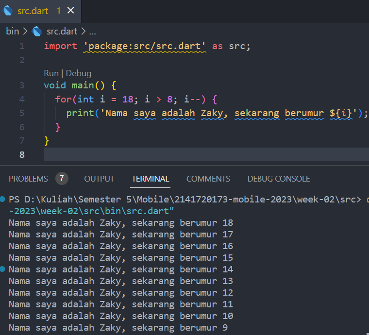

Nama: Mochammad Zaky Zamroni  
Nim: 2141720173  
Project: Tugas Praktikum Week-02  

# Soal 1  
Kode yang sudah dimodifikasi: 
 

# Soal 2 
Memahami bahasa pemrograman Dart sebelum kita menggunakan framework Flutter sangat penting karena Flutter dibangun dengan bahasa pemrograman Dart. Selain itu memahami Dart juga mempermudah pengelolaan state, debugging, penggunaan paket dan library, dan kustomisasi komponen Flutter.  

# Soal 3 
Rangkuman materi dari codelab: 
<h2>Pengertian</h2>
Dart adalah bahasa pemrograman yang menjadi inti dalam framework Flutter. Dirancang untuk memberikan pengalaman terbaik dalam pembuatan aplikasi seluler, Dart merupakan bahasa modern tingkat tinggi yang dipilih untuk digunakan dalam Flutter. Keunggulan Dart juga didukung oleh komunitas pengembang yang aktif.

<h2>Kelebihan Dart</h2>
<ul>
<li><b>Productive Tooling</b>: Alat-alat produktif untuk analisis kode, plugin IDE, dan ekosistem paket yang besar.</li>

<li><b>Garbage Collection</b>: Pengelolaan dealokasi memori, khususnya untuk objek yang tidak lagi digunakan.</li>

<li><b>Type Annotations (Opsional)</b>: Penyisipan tipe (opsional) untuk keamanan dan konsistensi dalam mengontrol data dalam aplikasi.</li>

<li><b>Statically Typed</b>: Meskipun tipe opsional, Dart tetap aman karena menggunakan type-safe dan type inference saat runtime, membantu dalam menemukan bug saat kompilasi.</li>

<li><b>Portability</b>: Dart dapat diterjemahkan ke JavaScript untuk web, dan juga dapat dikompilasi secara native ke kode ARM dan x86, memberikan portabilitas yang luas.</li>
</ul>

<h2>Cara Kerja Dart</h2>

Kompilasi JIT (Just-In-Time):

- Kode sumber dikompilasi saat dibutuhkan, secara langsung (just in time) saat program dijalankan oleh Dart VM.
Digunakan untuk pengembangan aplikasi, debugging, dan hot reload.
Memungkinkan perubahan kode yang cepat dan fleksibel selama pengembangan.
Kompilasi AOT (Ahead-Of-Time):

- Dart VM dan kode aplikasi dikompilasi sebelumnya sebelum aplikasi dijalankan.
Menyediakan performa yang lebih tinggi dibandingkan dengan JIT karena tidak ada overhead kompilasi saat runtime.
Tidak mendukung fitur debugging dan hot reload dengan sebaik JIT, karena kode sudah dikompilasi sebelumnya.

<h2>Struktur Dart</h2>
<h3>Object Orientation</h3>
Dart adalah bahasa pemrograman berorientasi objek (OOP) yang mengandalkan konsep objek untuk menyimpan data (disebut sebagai fields) dan kode (disebut sebagai methods). Objek-objek ini dibuat berdasarkan cetak biru yang disebut class, yang menentukan struktur data dan perilaku yang akan dimiliki oleh suatu objek. Dart mematuhi prinsip-prinsip OOP seperti encapsulation (enkapsulasi), inheritance (warisan), composition (komposisi), abstraction (abstraksi), dan polymorphism (polimorfisme). Jika Anda sudah memiliki pemahaman tentang konsep OOP dari bahasa pemrograman lain seperti Java, Anda akan menemukan bahwa konsep OOP dalam Dart serupa.
<h3>Operator Dart</h3>
Menggunakan operator, misalnya x == y, itu seakan-akan sama dengan memanggil metode x.==(y) untuk melakukan perbandingan kesetaraan. Dart memiliki perbedaan dengan bahasa seperti Java yang memiliki tipe data primitif, karena dalam Dart, semua tipe data adalah turunan dari kelas yang memiliki metode. Hal ini berarti bahwa Anda memiliki kemampuan untuk mengganti perilaku operator sesuai dengan logika yang Anda inginkan.
<h3>Operator Aritmatika</h3>
<ul>
<li>+ untuk tambahan.
<li>- untuk pengurangan.
<li>* untuk perkalian.
<li>/ untuk pembagian.
<li>~/ untuk pembagian bilangan bulat.
<li>% untuk operasi modulus (sisa bagi dari bilangan bulat).
<li>-expression untuk negasi (yang membalikkan suatu nilai).
</ul>
<h3>Operator Increment dan Decrement</h3>
<ul>
<li>++var atau var++ untuk menambah nilai variabel var sebesar 1
<li>--var atau var-- untuk mengurangi nilai variabel var sebesar 1
</ul>
<h3>Operator Persamaan dan Perbandingan</h3>
<ul>
<li>== untuk memeriksa apakah operan sama
<li>!= untuk memeriksa apakah operan berbeda
<li>> memeriksa apakah operan kiri lebih besar dari operan kanan
<li>< memeriksa apakah operan kiri lebih kecil dari operan kanan
<li>>= memeriksa apakah operan kiri lebih besar dari atau sama dengan operan kanan
<li><= memeriksa apakah operan kiri kurang dari atau sama dengan operan kanan
</ul>
<h3>Operator Logika</h3>
<ul>
<li>!expression negasi atau kebalikan hasil ekspresi—yaitu, true menjadi false dan false menjadi true.
<li>|| menerapkan operasi logika OR antara dua ekspresi.
<li>&& menerapkan operasi logika AND antara dua ekspresi.
</ul>