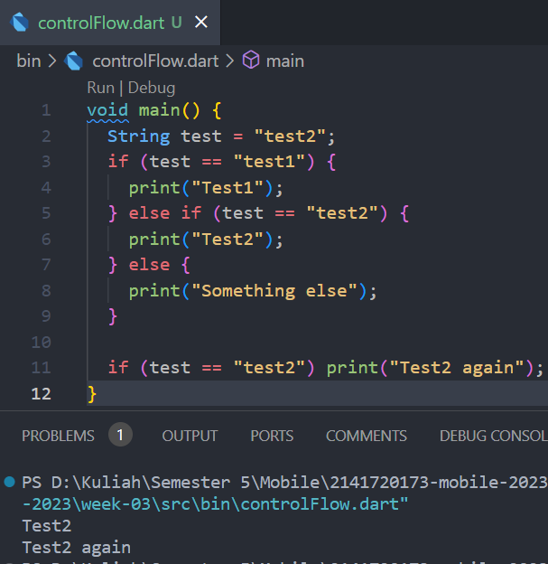
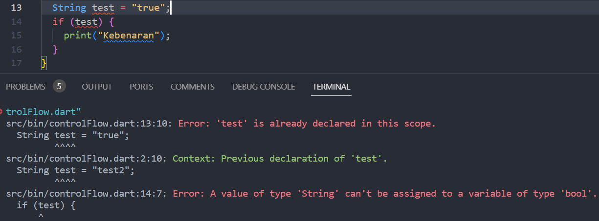
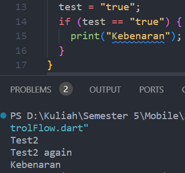
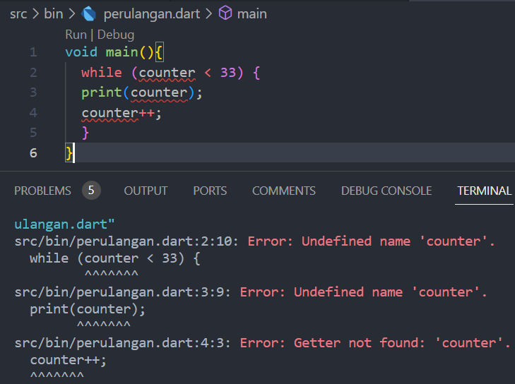
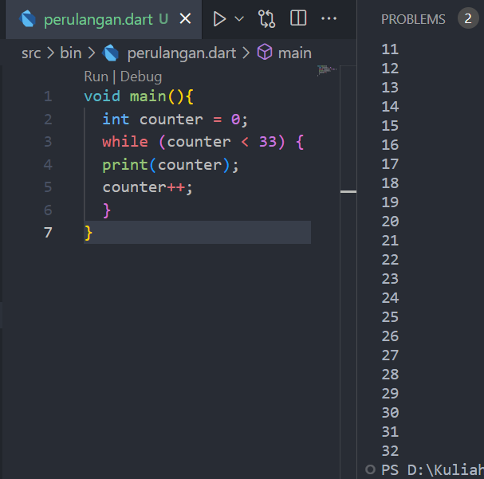
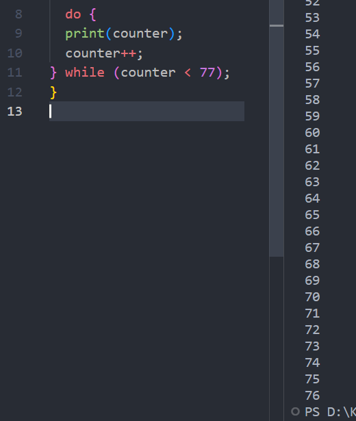
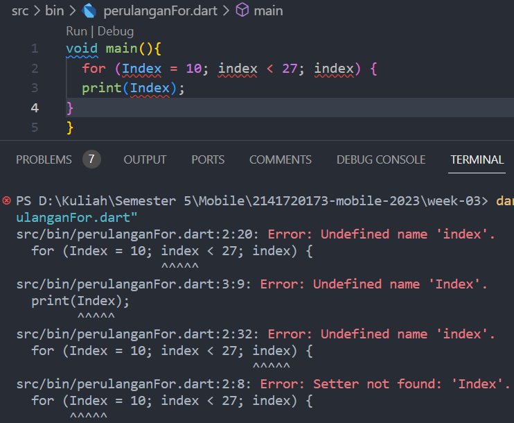
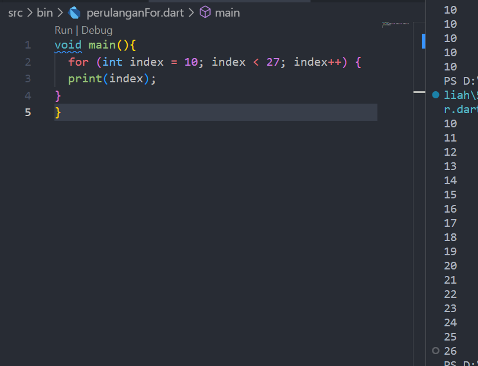
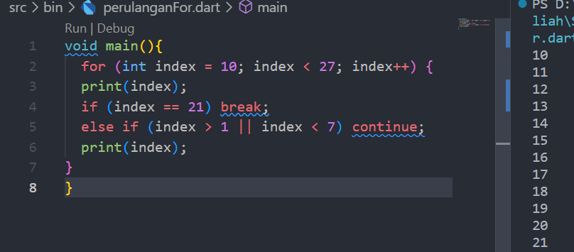
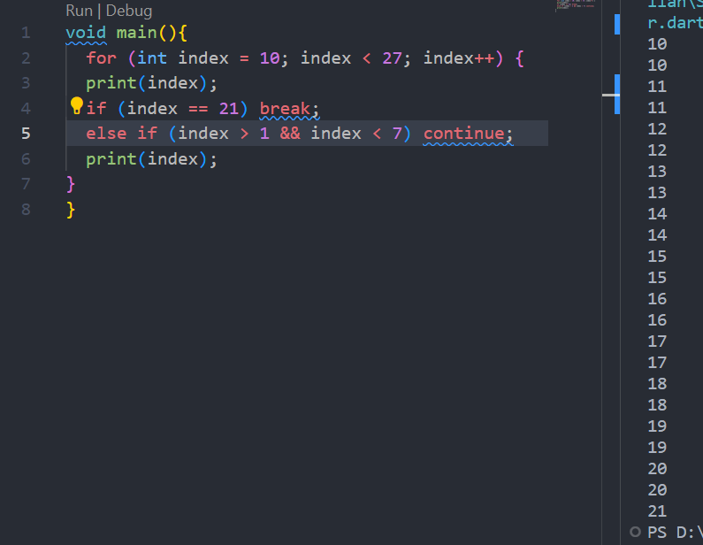

Nama: Mochammad Zaky Zamroni  
Nim: 2141720173  
Project: Praktikum Week-03  

# Praktikum 1: Menerapkan Control Flows ("if/else")
<h2>Langkah 1 & Langkah 2</h2>

 
Hasil eksekusi dari kode tersebut adalah <b>Test2</b> dan <b>Test2 again</b>. Karena pada inisialisasi awal, nilai variabel test adalah <b>test2</b> dan tidak diubah lagi. Sehingga pada control flows, kondisi yang cocok yaitu <b>else if(test == "test2")</b> dan <b>if(test == "test2")</b>. 
<h2>Langkah 3</h2>

  
Kode tersebut error karena variabel <b>text</b> sudah dideklarasikan di awal dan kondisi dalam if yang belum ada nilanya.    
  
Setelah kode diperbaiki, kode bisa dieksekusi dan menampilkan hasil tambahan yaitu <b>Kebenaran</b> 

# Praktikum 2: Menerapkan Perulangan "while" dan "do-while"
<h2>Langkah 1 & Langkah 2</h2>

Terjadi error pada kode tersebut karena variabel <b>counter</b> belum dideklarasikan dan belum memiliki nilai.   
 
Hasil eksekusi dari kode yang telah diperbaiki, menghasilkan perulangan print nilai variabel <b>counter</b> yang akan bertambah 1 nilai setiap terjadi perulangan. Perulangan terjadi sampai nilai variabel <b>counter</b> bernilai 32 (kurang dari 33). 

<h2>Langkah 3</h2>

 
Karena ditambahkan kode tersebut, perulangan terjadi hingga nilai variabel <b>counter</b> bernilai 76 (kurang dari 77). Tetapi pada tambahan kode tersebut dilakukan aksi(do) terlebih dahulu daripada kondisi perulangan(while) 

# Praktikum 3: Menerapkan Perulangan "for" dan "break-continue"
<h2>Langkah 1 & Langkah 2</h2>

 
Kode tersebut masih error karena variabel index belum dideklarasikan, dan tidak ada tindakan penambahan maupun pengurangan untuk perulangan.  

 
Setelah diperbaiki, eksekusi dari kode tersebut menghasilkan perulangan cetak nilai variabel <b>index</b> dan nilai variabel akan bertambah 1 setiap perulangan hingga <b>index</b> bernilai 26 (kurang dari 27).  

<h2>Langkah 3</h2>

Saat kode ditambahkan <b>break</b> lalu dieksekusi, hasil eksekusi berhenti saat variabel <b>index</b> bernilai 21.  

Saat operator pada else yang awalnya <b>atau ( || )</b> diubah menjadi <b>dan ( && )</b> maka melakukan eksekusi <b>continue</b> print nilai variabel <b>index</b>, sehingga hasil eksekusi terduplikat saat nilai <b>index</b> 10-20.
 

# Tugas Praktikum
Buatlah sebuah program yang dapat menampilkan bilangan prima dari angka 0 sampai 201 menggunakan Dart. Ketika bilangan prima ditemukan, maka tampilkan nama lengkap dan NIM Anda.
