Nama: Mochammad Zaky Zamroni <br>
Nim: 2141720173 <br>
Project: Praktikum Week-04 <br>

# Praktikum 1: Eksperimen Tipe Data List
<h2>Langkah 1 & Langkah 2</h2>

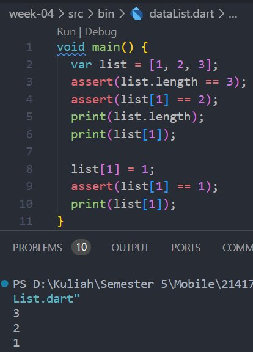</br>
Hasil eksekusi dari kode tersebut adalah panjang list, nilai indeks 1 pada list, dan nilai indeks 1 yang sudah diubah yang awalnya 2 menjadi 1. Fungsi `assert` pada kode digunakan untuk melakukan pengecekan, saat kondisinya sesuai pada pengecekan maka kode akan dieksekusi.</br>

<h2>Langkah 3</h2>

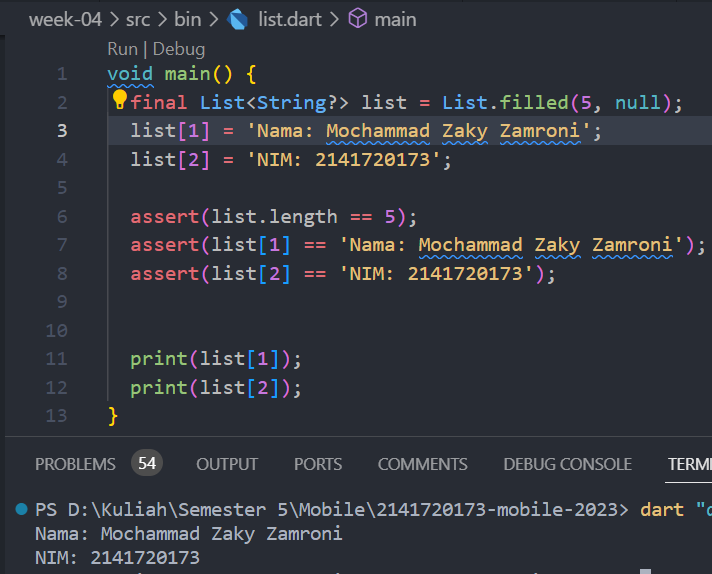</br>
Sebelumnya, terjadi error karena default valuenya null. Diperbaiki dengan menspesifikkan tipe data isi list dan membuatnya null safety. </br>

# Praktikum 2: Eksperimen Tipe Data Set
<h2>Langkah 1 & Langkah 2</h2>

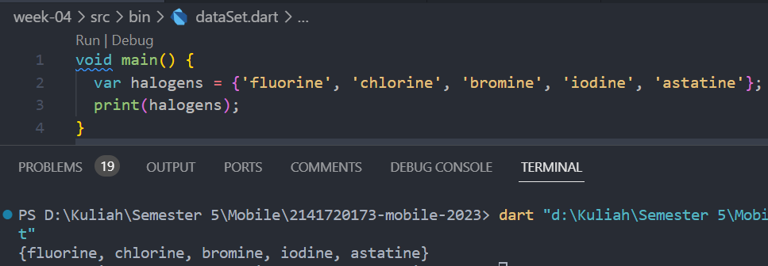</br>
Eksekusi kode tersebut menghasilkan cetak isi dari set `halogens`. </br>

<h2>Langkah 3</h2>

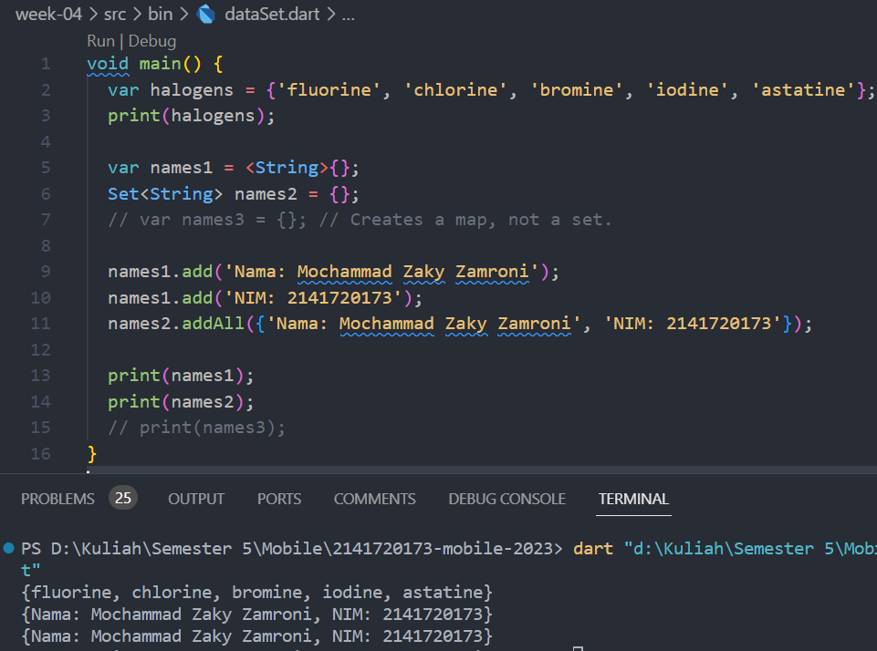</br>
Variabel set `names1` dan `names2` memiliki cara inisialisasi yang berbeda. Memasukkan nilai dengan `.add()` dan `.addAll()` ke variabel set. Lalu mencentak isi variabel tersebut.</br>

# Praktikum 3: Eksperimen Tipe Data Maps

<h2>Langkah 1 & 2</h2>

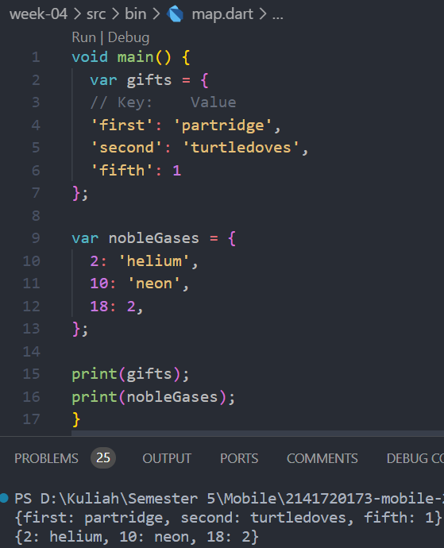</br>
Membuat 2 variabel maps, variabel maps berisi key dan valuenya. Lalu mencetak isi dari variabel maps tersebut.</br>

<h2>Langkah 3</h2>

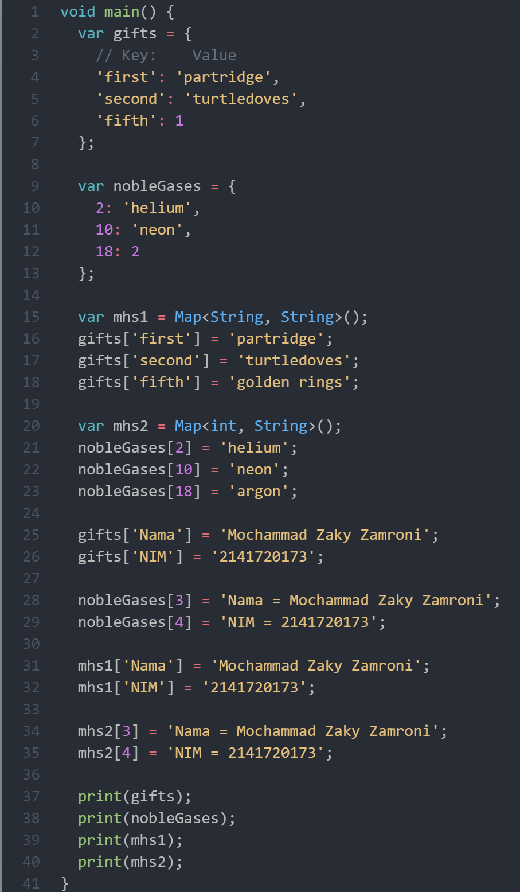</br>
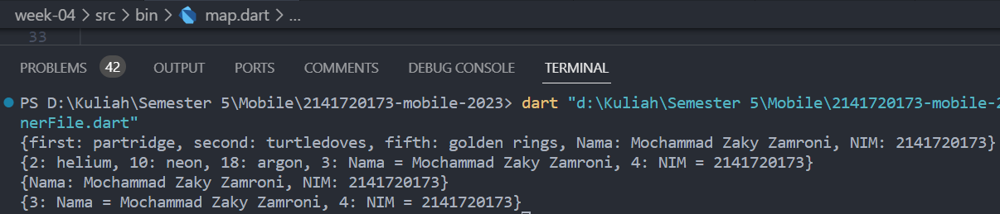</br>
Membuat variabel baru yaitu `mhs1` dan `mhs2` yang merubah value dari key `fifth` pada variabel gifts dan value dari key `18` pada variabel nobleGases. Lalu menambahkan isi key dan value `nama` `nim` ke variabel gifts dan variabel nobleGases. Kemudian mencetak isi dari variabel-variabel tersebut.

# Praktikum 4: Eksperimen Tipe Data List: Spread dan Control-flow Operators

<h2>Langkah 1 & 2</h2>

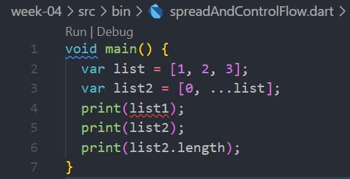</br>
Kode error karena mencetak variabel bernama list1 dan tidak ada variabel bernama list1.</br>
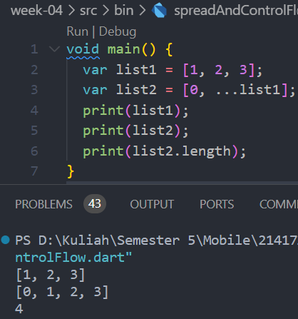</br>
Merubah variabel list menjadi list1. variabel list2 berisi 0 dan value dari list1. Mencetak isi variabel list1 dan list2. Lalu mencetak panjang/jumlah isi dari list2.</br> 

<h2>Langkah 3</h2>

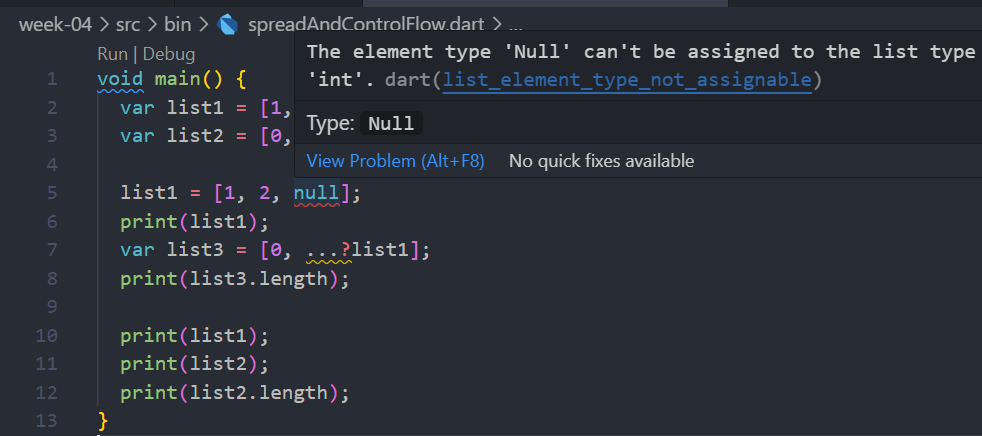</br>
Kode error karena isi variabel list1 bertipe data int, sehingga variabel list1 diinisiasi menjadi bertipe data int dan tidak bisa diisi dengan null.</br>
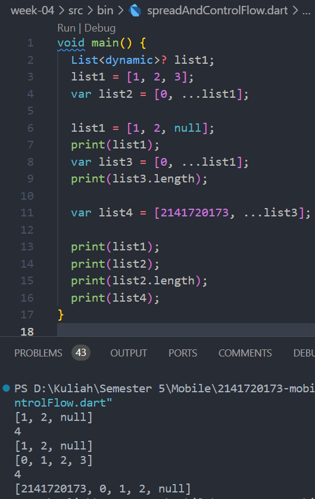</br>
Merubah tipe data list1 menjadi dynamic dan memberi null safety agar bisa diisi null. Membuat variabel baru list3 berisi 0 dan value variabel list1 yang telah diganti. Membuat variabel baru list4 yang berisi `nim` dan value dari variabel list3.</br>

<h2>Langkah 4</h2>

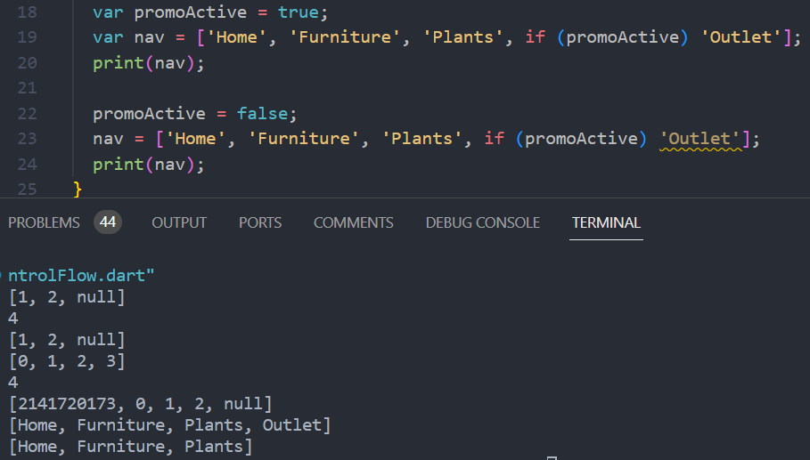</br>
Menggunakan control flow operator `if` pada variabel promoActive. Bisa dilihat pada output perbedaan saat variabel promoActive bernilai true atau false. Jika true maka ada value `Outlet` pada vaiabel nav, dan sebaliknya jika false maka tidak ada value `Outlet` pada variabel nav.</br>

<h2>Langkah 5</h2>

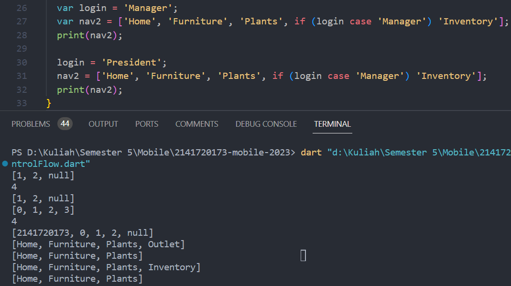</br>
Menggunakan control flow operator `if` dan `case` pada variabel login. Saat variabel login memiliki value `Manager` maka ada value `Inventory` pada variabel nav2, dan sebaliknya jika login memiliki value lain selain `Manager` maka tidak ada value `Inventory` pada variabel nav2.</br>

<h2>Langkah 6</h2>

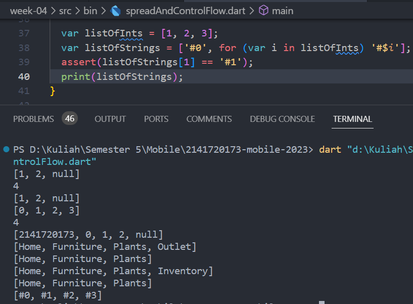</br>
Menggunakan control flow operator perulangan `for` untuk mengisi variabel listOfStrings dengan value dari variabel listOfInts.</br>

# Praktikum 5: Eksperimen Tipe Data Records

<h2>Langkah 1 & 2</h2>

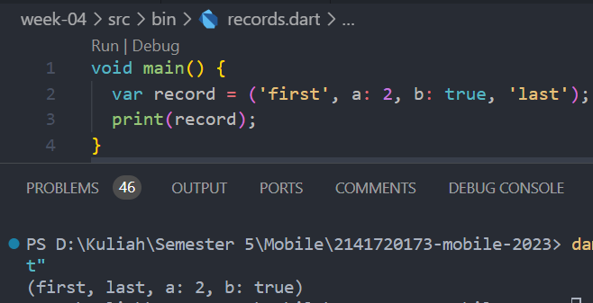</br>
Membuat variabel record lalu mencetaknya.</br>

<h2>Langkah 3</h2>

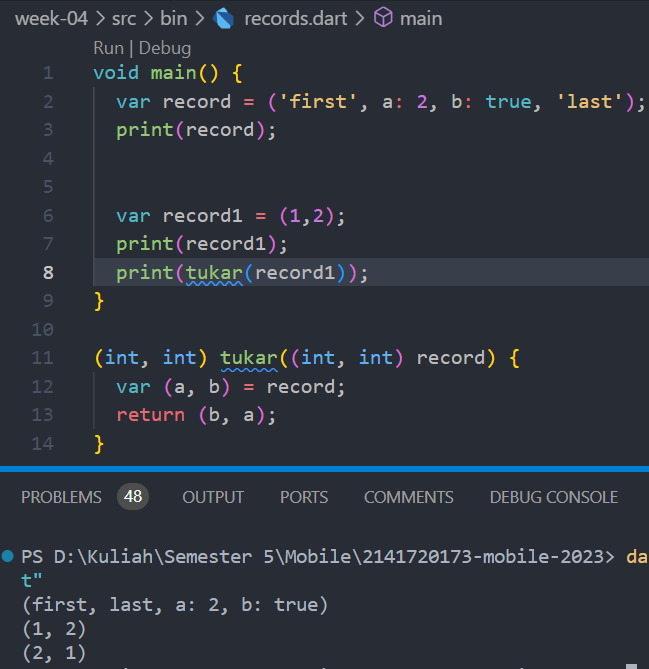</br>
Membuat function tukar untuk menukar urutan value dari variabel record1.</br>

<h2>Langkah 4</h2>

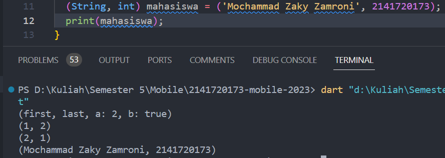</br>
Menginisiasi variabel mahasiswa dengan spesifik tipe data value `(String, int)`.</br>

<h2>Langkah 5</h2>

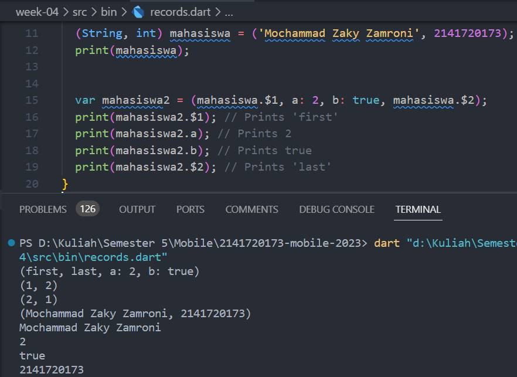</br>
Membuat variabel records baru bernama mahasiswa2. Mengganti value `first` dan `last` dengan nama dan nim saya.

# Tugas Praktikum
<ol>
<li>Silakan selesaikan Praktikum 1 sampai 5, lalu dokumentasikan berupa screenshot hasil pekerjaan Anda beserta penjelasannya!</li>
<li>Jelaskan yang dimaksud Functions dalam bahasa Dart!</br>
Dart adalah bahasa pemrograman berorientasi objek, yang berarti bahwa functions dalam Dart juga adalah objek. Functions dapat dianggap sebagai blok kode yang dapat dipanggil lagi dan memiliki tipe data. Kita dapat menyimpan functions dalam variabel atau meneruskannya sebagai argumen ke functions lain. Functions pada dasarnya adalah instruksi dijalankan dengan cara memanggilnya.</li>
<li>Jelaskan jenis-jenis parameter di Functions beserta contoh sintaksnya!</br>
<ul>**Named Parameter**

dipanggil dengan menyebutkan nama parameter yang sesuai.
Ini berguna untuk meningkatkan kejelasan saat memanggil function dengan banyak parameters.

```dart
void example({bool? firstParameter, bool? secondParameter}){}
``` 
</ul>
<ul>**Optional Positional Parameters**

parameters yang dicocokkan berdasarkan urutan posisinya saat memanggil function.

```dart
String say(String from, String msg, [String? device]) {
  var result = '$from says $msg';
  if (device != null) {
    result = '$result with a $device';
  }
  return result;
}
``` 
</ul>
</li>
<li>Jelaskan maksud Functions sebagai first-class objects beserta contoh sintaknya!</br>
Konsep "functions as first-class objects" mengacu pada kemampuan sebuah bahasa pemrograman untuk memperlakukan functions seperti tipe data lainnya, seperti integer, string, atau objek. 

```dart
void cetakPesan(String Function(String) pesanFunction) {
  var pesan = pesanFunction("Dunia");
  print(pesan);
}

String salam(String nama) {
  return "Halo, $nama!";
}

void main() {
  cetakPesan(salam);
}
``` 
output:</br> 
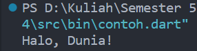
</li>
<li>Apa itu Anonymous Functions? Jelaskan dan berikan contohnya!</br>
Anonymous Functions adalah function yang tidak memiliki nama. Dalam Dart, untuk membuat anonymous functions menggunakan sintaksis berikut

```dart
(parameter){
    // kode function
}
``` 

Contoh penggunaan anonymous function dalam Dart:

```dart
var cetakPesan = () {
    print("Hello, World!");
  };

  cetakPesan();
``` 

</li>
<li>Jelaskan perbedaan Lexical scope dan Lexical closures! Berikan contohnya!</br>
<ul>
Lexical scope mengacu pada aturan tentang bagaimana penentuan cakupan (scope) variabel dalam kode program ditentukan oleh struktur kode yang bersangkutan. Cakupan variabel ditentukan berdasarkan tempat variabel tersebut didefinisikan dalam kode, tidak bergantung pada bagaimana atau di mana variabel tersebut dipanggil. Contoh:

```dart
void main() {
  var x = 10;

  void innerFunction() {
    var y = 20;
    print(x); // Variabel x dapat diakses karena dalam lexical scope yang sama.
    print(y);
  }

  innerFunction();
  // print(y); akan error karena variabel y hanya dideklarasikan dalam lexical scope innerFunction.
}

```
</ul>

<ul>Lexical closures terjadi ketika sebuah function (atau lambda expression) memiliki akses ke variabel-variabel yang berada di lingkup (scope) yang lebih tinggi, bahkan setelah lingkup yang lebih tinggi tersebut sudah selesai dieksekusi. Ini terjadi karena function tersebut "menutup" (closure) variabel-variabel yang diperlukan agar dapat mengaksesnya nanti, bahkan ketika sudah berada di luar lingkup aslinya. Contoh:

```dart
Function outerFunction() {
  var x = 10;

  return () {
    print(x); // Function ini memiliki akses ke variabel x dari lingkup outerFunction.
  };
}

void main() {
  var closure = outerFunction();
  closure(); // Memanggil function yang merupakan lexical closure.
}

```

</ul>
</li>

<li>Jelaskan dengan contoh cara membuat return multiple value di Functions!</br>
<ul>Menggunakan list:

```dart
List<int> getMinMax(List<int> numbers) {
  int min = numbers[0];
  int max = numbers[0];

  for (int number in numbers) {
    if (number < min) {
      min = number;
    }
    if (number > max) {
      max = number;
    }
  }

  return [min, max];
}

void main() {
  List<int> numbers = [3, 1, 4, 1, 5, 9, 2, 6, 5, 3, 5];

  List<int> result = getMinMax(numbers);

  print("Min: ${result[0]}, Max: ${result[1]}");
}

```

</ul>
<ul>
Menggunakan map:

```dart
Map<String, int> getMinMax(List<int> numbers) {
  int min = numbers[0];
  int max = numbers[0];

  for (int number in numbers) {
    if (number < min) {
      min = number;
    }
    if (number > max) {
      max = number;
    }
  }

  return {'min': min, 'max': max};
}

void main() {
  List<int> numbers = [3, 1, 4, 1, 5, 9, 2, 6, 5, 3, 5];

  Map<String, int> result = getMinMax(numbers);

  print("Min: ${result['min']}, Max: ${result['max']}");
}

```

</ul>
<ul>
Menggunakan records:

```dart
class MinMax {
  final int min;
  final int max;

  MinMax(this.min, this.max);
}

MinMax getMinMax(List<int> numbers) {
  int min = numbers[0];
  int max = numbers[0];

  for (int number in numbers) {
    if (number < min) {
      min = number;
    }
    if (number > max) {
      max = number;
    }
  }

  return MinMax(min, max);
}

void main() {
  List<int> numbers = [3, 1, 4, 1, 5, 9, 2, 6, 5, 3, 5];

  MinMax result = getMinMax(numbers);

  print("Min: ${result.min}, Max: ${result.max}");
}

```

</ul>

</li>

</ol>
