# Week 05 - Flutter Fundamental Part 1

## Praktikum 1: Membuat Project Flutter Baru

### Langkah 1
Membuat project baru dengan cara menekan tombol Ctrl + Shift + P, lalu ketik Flutter. Pilih New Project. 
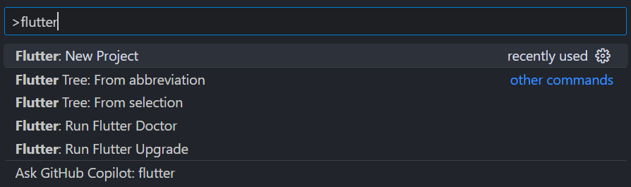 
Lalu pilih Application. 
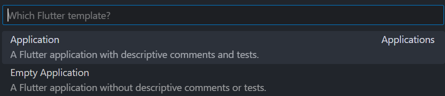

### Langkah 2
Memilih folder untuk tempat project flutter yang dibuat. 
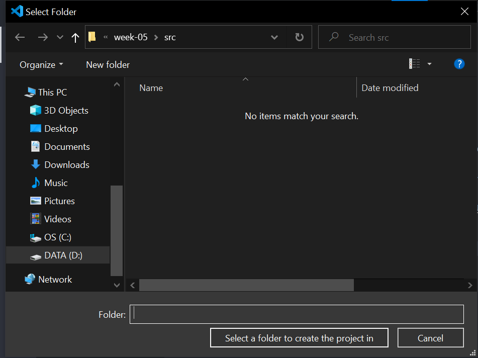

### Langkah 3
Memberi nama project. 
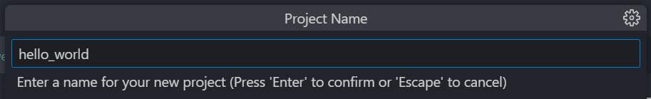

### Langkah 4
Berhasil membuat project Flutter baru. 
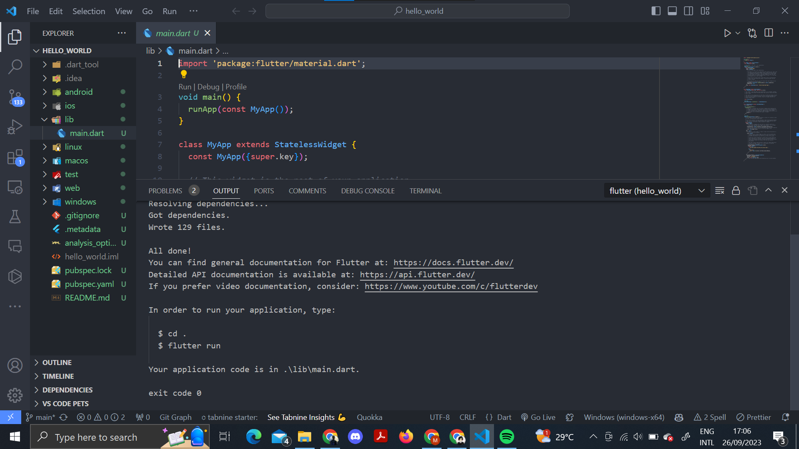

## Praktikum 2: Membuat Repository GitHub dan Laporan Praktikum

## Praktikum 3: Menerapkan Widget Dasar

### Langkah 1: Text Widget
Membuat folder baru basic_widgets di dalam folder lib. Kemudian membuat file baru di dalamnya berisi text widget. 
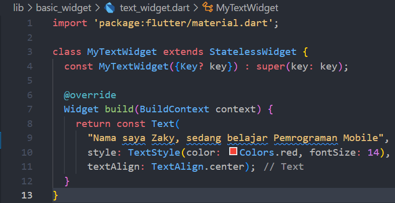 
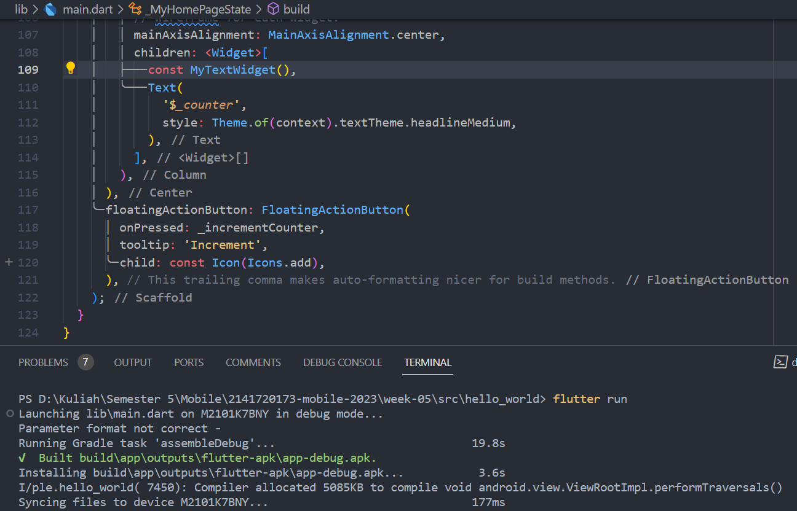 
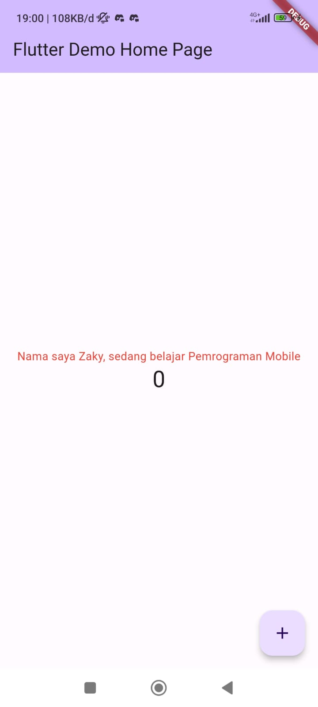 

### Langkah 2: Image Widget
Membuat file image_widget.dart di dalam folder basic_widgets 
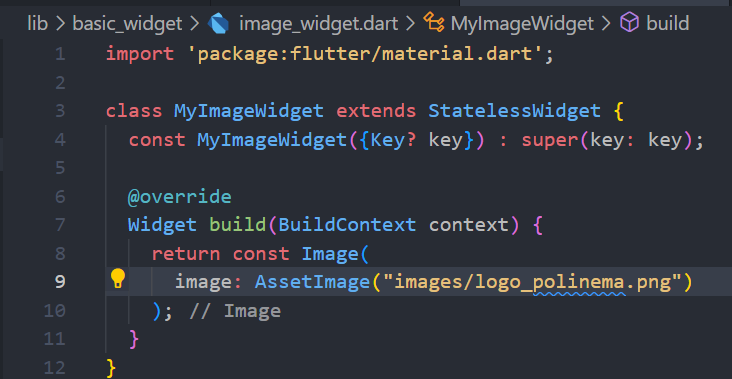 
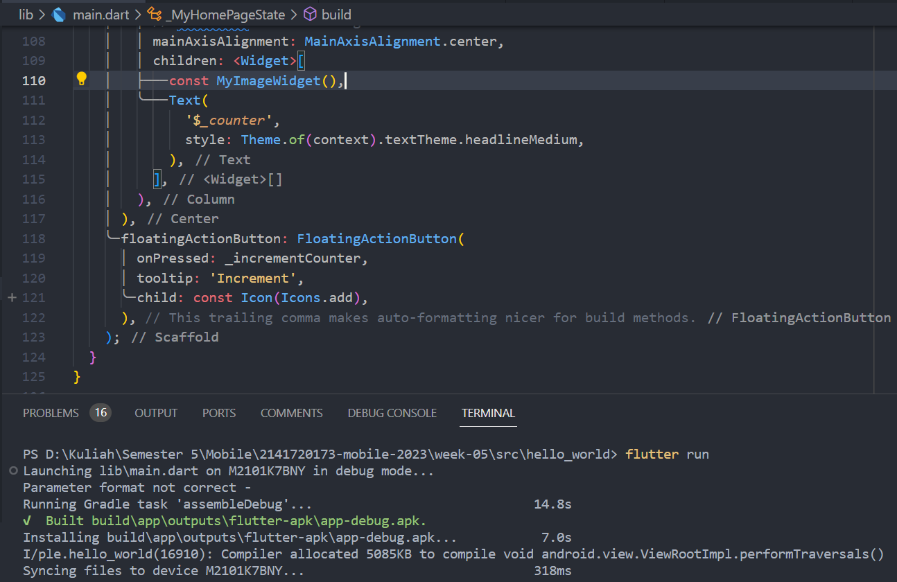 
Menyesuaikan asset pada file pubspec.yaml dan tambahkan file logo ke dalam folder image project hello_world. 
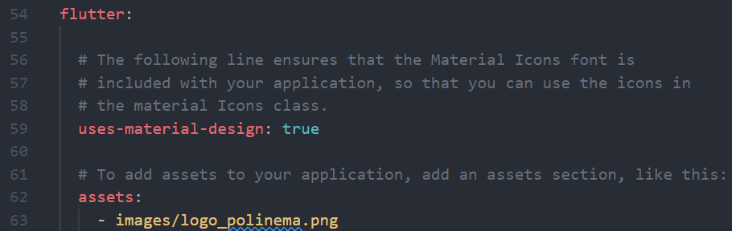 
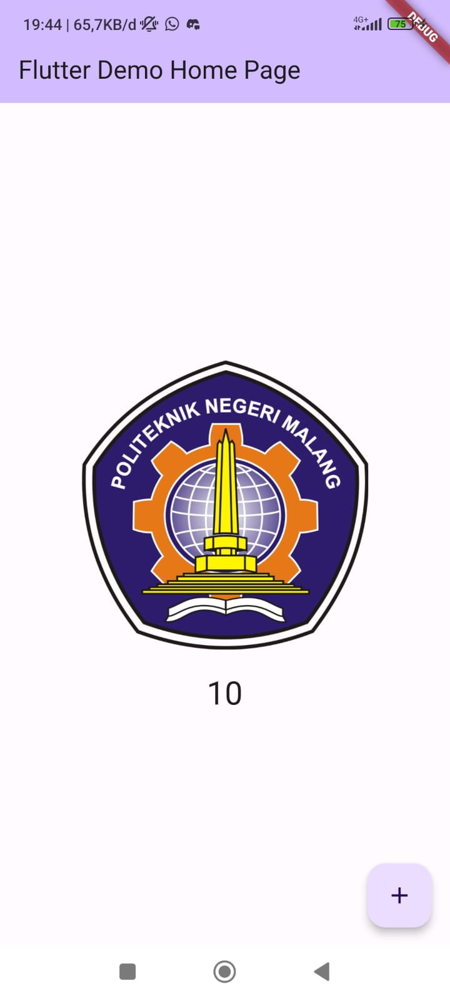

