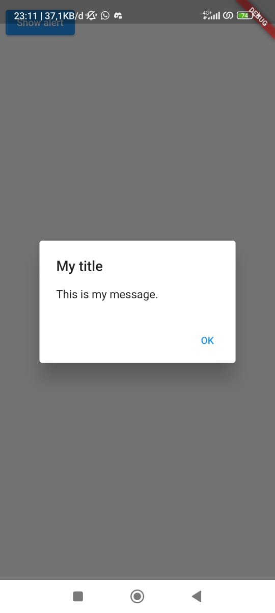

# Week 05 - Flutter Fundamental Part 1

## Praktikum 1: Membuat Project Flutter Baru

### Langkah 1
Membuat project baru dengan cara menekan tombol Ctrl + Shift + P, lalu ketik Flutter. Pilih New Project.</br>
</br>
Lalu pilih Application.</br>


### Langkah 2
Memilih folder untuk tempat project flutter yang dibuat.</br>


### Langkah 3
Memberi nama project.</br>


### Langkah 4
Berhasil membuat project Flutter baru.</br>


## Praktikum 2: Membuat Repository GitHub dan Laporan Praktikum

## Praktikum 3: Menerapkan Widget Dasar

### Langkah 1: Text Widget
Membuat folder baru basic_widgets di dalam folder lib. Kemudian membuat file baru di dalamnya berisi text widget.</br>
</br>
</br>
</br>

### Langkah 2: Image Widget
Membuat file image_widget.dart di dalam folder basic_widgets</br>
</br>
</br>
Menyesuaikan asset pada file pubspec.yaml dan tambahkan file logo ke dalam folder image project hello_world.</br>
</br>


## Praktikum 4: Menerapkan Widget Material Design dan iOS Cupertino
### Langkah 1: Cupertino Button dan Loading Bar
Membuat file widget di folder basic_widgets dengan nama loading_cupertino.dart</br>
</br>
### Langkah 2: Floating Action Button (FAB)
Membuat file widget Floating Action Button (FAB) di folder basic_widget dengan nama fab_widget.dart</br>
</br>
### Langkah 3: Scaffold Widget
Menggunakan scaffold untuk mengatur tata letak sesuai dengan material design. Mengubah file main menjadi seperti berikut.</br>
</br>
Output:</br>

### Langkah 4: Dialog Widget
Mengubah file main untuk menggunakan dialog widget. Dialog widget pada flutter memiliki dua jenis dialog yaitu AlertDialog dan SimpleDialog.</br>
</br>
Output:</br>

### Langkah 5: Input dan Selection Widget
Flutter menyediakan widget yang dapat menerima input dari pengguna aplikasi yaitu antara lain Checkbox, Date and Time Pickers, Radio Button, Slider, Switch, TextField. Mengubah file main untuk menggunakan input TextField.</br>
</br>
Output:</br>
</br>

### Langkah 6: Date and Time Pickers
Date and Time Pickers termasuk pada kategori input dan selection widget. Mengubah file main untuk menggunakan Date and Time Pickers.</br>
</br>
Output:</br>


## Tugas Praktikum

### No 2
Pada praktikum 4 mulai dari Langkah 3 sampai 6, buatlah file widget tersendiri di folder basic_widgets, kemudian pada file main.dart cukup melakukan import widget sesuai masing-masing langkah tersebut!
#### Langkah 3
Membuat file scaffold_widget
```dart
import 'package:flutter/material.dart';

class MyScaffoldWidget extends StatelessWidget {
  final String title;
  final int counter;
  final VoidCallback incrementCounter;

  const MyScaffoldWidget({
    Key? key,
    required this.title,
    required this.counter,
    required this.incrementCounter,
  }) : super(key: key);

  @override
  Widget build(BuildContext context) {
    return Scaffold(
      appBar: AppBar(
        title: Text(title),
      ),
      body: Center(
        child: Column(
          mainAxisAlignment: MainAxisAlignment.center,
          children: <Widget>[
            const Text(
              'You have pushed the button this many times:',
            ),
            Text(
              '$counter',
              style: Theme.of(context).textTheme.headline4,
            ),
          ],
        ),
      ),
      bottomNavigationBar: BottomAppBar(
        child: Container(
          height: 50.0,
        ),
      ),
      floatingActionButton: FloatingActionButton(
        onPressed: incrementCounter,
        tooltip: 'Increment Counter',
        child: const Icon(Icons.add),
      ),
      floatingActionButtonLocation: FloatingActionButtonLocation.centerDocked,
    );
  }
}
```
Mengubah file main untuk menggunakan widget
```dart
import 'dart:async';
import 'package:flutter/material.dart';

import 'basic_widget/scaffold_widget.dart';

void main() => runApp(const MyApp());

class MyApp extends StatelessWidget {
  const MyApp({Key? key}) : super(key: key);

  @override
  Widget build(BuildContext context) {
    return const MaterialApp(
      title: 'Menggunakan Scaffold Widget',
      home: MyHomePage(title: 'Menggunakan Scaffold Widget'),
    );
  }
}

class MyHomePage extends StatefulWidget {
  const MyHomePage({Key? key, required this.title}) : super(key: key);

  final String title;

  @override
  _MyHomePageState createState() => _MyHomePageState();
}

class _MyHomePageState extends State<MyHomePage> {
  int _counter = 0;

  void _incrementCounter() {
    setState(() {
      _counter++;
    });
  }

  @override
  Widget build(BuildContext context) {
    return MyScaffoldWidget(
      title: widget.title,
      counter: _counter,
      incrementCounter: _incrementCounter,
    );
  }
}
```
Output:</br>

### Langkah 4
Membuat file dialog widget
```dart
import 'package:flutter/material.dart';

class MyDialogWidget extends StatelessWidget {
  const MyDialogWidget({Key? key}) : super(key: key);

  @override
  Widget build(BuildContext context) {
    return Padding(
      padding: const EdgeInsets.all(8.0),
      child: ElevatedButton(
        child: const Text('Show alert'),
        onPressed: () {
          showAlertDialog(context);
        },
      ),
    );
  }
}

showAlertDialog(BuildContext context) {
  Widget okButton = TextButton(
    child: const Text("OK"),
    onPressed: () {
      Navigator.pop(context);
    },
  );

  AlertDialog alert = AlertDialog(
    title: const Text("My title"),
    content: const Text("This is my message."),
    actions: [
      okButton,
    ],
  );

  showDialog(
    context: context,
    builder: (BuildContext context) {
      return alert;
    },
  );
}
```
Mengubah file main untuk menggunakan widget
```dart
import 'dart:async';
import 'package:flutter/material.dart';

import 'basic_widget/dialog_widget.dart';

void main() => runApp(const MyApp());

class MyApp extends StatelessWidget {
  const MyApp({Key? key}) : super(key: key);

  @override
  Widget build(BuildContext context) {
    return const MaterialApp(
      home: Scaffold(
        body: MyDialogWidget(),
      ),
    );
  }
}
```
Output:</br>


#### Langkah 5
Membuat input dan selection widget
```dart
import 'package:flutter/material.dart';

class MyInputSelection extends StatelessWidget {
  const MyInputSelection({Key? key}) : super(key: key);

  @override
  Widget build(BuildContext context) {
    return MaterialApp(
      home: Scaffold(
        appBar: AppBar(title: const Text("Contoh TextField")),
        body: const TextField(
          obscureText: false,
          decoration: InputDecoration(
            border: OutlineInputBorder(),
            labelText: 'Nama',
          ),
        ),
      ),
    );
  }
}
```
Mengubah file main untuk menggunakan widget
```dart
import 'dart:async';
import 'package:flutter/material.dart';

import 'basic_widget/input_selection_widget.dart';

void main() => runApp(const MyApp());

class MyApp extends StatelessWidget {
  const MyApp({Key? key}) : super(key: key);

  @override
  Widget build(BuildContext context) {
    return const MaterialApp(
      home: Scaffold(
        body: MyInputSelection(),
      ),
    );
  }
}
```
Output:</br>


#### Langkah 6
Membuat date and time pickers widget
```dart
import 'package:flutter/material.dart';

class MyDateTime extends StatefulWidget {
  const MyDateTime({Key? key, required this.title}) : super(key: key);

  final String title;

  @override
  _MyDateTimeState createState() => _MyDateTimeState();
}

class _MyDateTimeState extends State<MyDateTime> {
  DateTime selectedDate = DateTime.now();

  Future<void> _selectDate(BuildContext context) async {
    final DateTime? picked = await showDatePicker(
        context: context,
        initialDate: selectedDate,
        firstDate: DateTime(2015, 8),
        lastDate: DateTime(2101));
    if (picked != null && picked != selectedDate) {
      setState(() {
        selectedDate = picked;
      });
    }
  }

  @override
  Widget build(BuildContext context) {
    return Scaffold(
      appBar: AppBar(
        title: Text(widget.title),
      ),
      body: Center(
        child: Column(
          mainAxisSize: MainAxisSize.min,
          children: <Widget>[
            Text("${selectedDate.toLocal()}".split(' ')[0]),
            const SizedBox(
              height: 20.0,
            ),
            ElevatedButton(
              onPressed: () => {
                _selectDate(context),
                print(selectedDate.day + selectedDate.month + selectedDate.year)
              },
              child: const Text('Pilih Tanggal'),
            ),
          ],
        ),
      ),
    );
  }
}
```
Mengubah file main untuk menggunakan widget
```dart
import 'dart:async';
import 'package:flutter/material.dart';

import 'basic_widget/date_time_widget.dart';

void main() => runApp(const MyApp());

class MyApp extends StatelessWidget {
  const MyApp({Key? key}) : super(key: key);

  @override
  Widget build(BuildContext context) {
    return const MaterialApp(
      home: Scaffold(
        body: MyDateTime(title: 'Contoh Date Picker',),
      ),
    );
  }
}
```
Output:</br>


#### No 3
Menyelesaikan Codelabs: Your first Flutter app

Source code: https://github.com/zakyzuf/2141720173-mobile-2023/tree/main/week-05/src/codelabs