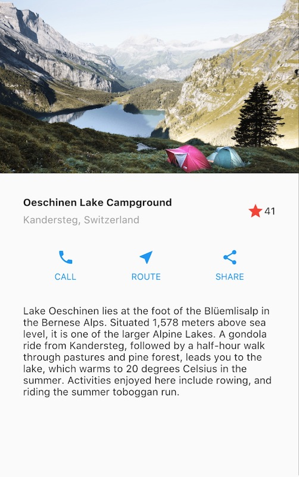

# Praktikum 1: Membangun Layout di Flutter
## Tampilan Akhir yang akan dibuat

## Langkah 1: Buat Project Baru
Membuat sebuah project flutter baru dengan nama <b>layout_flutter</b>.
## Langkah 2: Buka file lib/main.dart
Mengganti kode main. Isi nama dan NIM di text title.

```dart
import 'package:flutter/material.dart';

void main() => runApp(const MyApp());

class MyApp extends StatelessWidget {
  const MyApp({super.key});

  @override
  Widget build(BuildContext context) {
    return MaterialApp(
      title: 'Flutter layout: Mochammad Zaky Zamroni - 2141720173',
      home: Scaffold(
        appBar: AppBar(
          title: const Text('Flutter layout demo'),
        ),
        body: const Center(
          child: Text('Hello World'),
        ),
      ),
    );
  }
}
```

## Langkah 3: Identifikasi layout diagram

## Langkah 4: Implementasi title row
Membuat kolom bagian kiri pada judul. Tambahkan kode berikut di bagian atas metode build() di dalam kelas MyApp:
```dart
Widget titleSection = Container(
  padding: const EdgeInsets.all(...),
  child: Row(
    children: [
      Expanded(
        /* soal 1*/
        child: Column(
          crossAxisAlignment: ...,
          children: [
            /* soal 2*/
            Container(
              padding: const EdgeInsets.only(bottom: ...),
              child: const Text(
                'Wisata Gunung di Batu',
                style: TextStyle(
                  fontWeight: FontWeight.bold,
                ),
              ),
            ),
            Text(
              'Batu, Malang, Indonesia',
              style: TextStyle(...),
            ),
          ],
        ),
      ),
      /* soal 3*/
      Icon(
       ...,
        color: ...,
      ),
      const Text(...),
    ],
  ),
);
```

<b>/* soal 1 */</b> Letakkan widget `Column` di dalam widget `Expanded` agar menyesuaikan ruang yang tersisa di dalam widget `Row`. Tambahkan properti `crossAxisAlignment` ke `CrossAxisAlignment.start` sehingga posisi kolom berada di awal baris.

<b>/* soal 2 */</b> Letakkan baris pertama teks di dalam `Container` sehingga memungkinkan Anda untuk menambahkan padding = 8. Teks `'Batu, Malang, Indonesia'` di dalam `Column`, set warna menjadi abu-abu.

<b>/* soal 3 */</b> Dua item terakhir di baris judul adalah ikon bintang, set dengan warna merah, dan teks "41". Seluruh baris ada di dalam `Container` dan beri padding di sepanjang setiap tepinya sebesar 32 piksel. Kemudian ganti isi ``body text 'Hello World'`` dengan variabel ``titleSection``</br>

Kode setelah soal diselesaikan:
```dart
import 'package:flutter/material.dart';

void main() => runApp(MyApp());

class MyApp extends StatelessWidget {
  MyApp({super.key});
  
  Widget titleSection = Container(
  padding: const EdgeInsets.all(32),
  child: Row(
    children: [
      Expanded(
        /* soal 1*/
        child: Column(
          crossAxisAlignment: CrossAxisAlignment.start,
          children: [
            /* soal 2*/
            Container(
              padding: const EdgeInsets.only(bottom: 8),
              child: const Text(
                'Wisata Gunung di Batu',
                style: TextStyle(
                  fontWeight: FontWeight.bold,
                ),
              ),
            ),
            const Text(
              'Batu, Malang, Indonesia',
              style: TextStyle(color: Colors.grey)),
          ],
        ),
      ),
      /* soal 3*/
      const Icon(
        Icons.star,
        color: Colors.red,
      ),
      const Text('41'),
      ],
    ),
  );

  @override
  Widget build(BuildContext context) {
    return MaterialApp(
      title: 'Flutter layout: Mochammad Zaky Zamroni - 2141720173',
      home: Scaffold(
        appBar: AppBar(
          title: const Text('Flutter layout demo'),
        ),
        body: Column(
          children: [titleSection],
        ),
      ),
    );
  }
}
```

Output:</br>


# Praktikum 2: Implementasi button row
## Langkah 1: Buat method Column _buildButtonColumn
Bagian tombol berisi 3 kolom yang menggunakan tata letak yang sama—sebuah ikon di atas baris teks. Kolom pada baris ini diberi jarak yang sama, dan teks serta ikon diberi warna primer.

Karena kode untuk membangun setiap kolom hampir sama, buatlah metode pembantu pribadi bernama ``buildButtonColumn()``, yang mempunyai parameter warna, Icon dan Text, sehingga dapat mengembalikan kolom dengan widgetnya sesuai dengan warna tertentu.
<b>lib/main.dart (_buildButtonColumn)</b>

```dart
class MyApp extends StatelessWidget {
  const MyApp({super.key});

  @override
  Widget build(BuildContext context) {
    // ···
  }

  Column _buildButtonColumn(Color color, IconData icon, String label) {
    return Column(
      mainAxisSize: MainAxisSize.min,
      mainAxisAlignment: MainAxisAlignment.center,
      children: [
        Icon(icon, color: color),
        Container(
          margin: const EdgeInsets.only(top: 8),
          child: Text(
            label,
            style: TextStyle(
              fontSize: 12,
              fontWeight: FontWeight.w400,
              color: color,
            ),
          ),
        ),
      ],
    );
  }
}
```

## Langkah 2: Buat widget buttonSection
Buat Fungsi untuk menambahkan ikon langsung ke kolom. Teks berada di dalam ``Container`` dengan margin hanya di bagian atas, yang memisahkan teks dari ikon.

Bangun baris yang berisi kolom-kolom ini dengan memanggil fungsi dan set warna, ``Icon``, dan teks khusus melalui parameter ke kolom tersebut. Sejajarkan kolom di sepanjang sumbu utama menggunakan ``MainAxisAlignment.spaceEvenly`` untuk mengatur ruang kosong secara merata sebelum, di antara, dan setelah setiap kolom. Tambahkan kode berikut tepat di bawah deklarasi ``titleSection`` di dalam metode ``build()``:

<b>lib/main.dart (buttonSection)</b>

```dart
Color color = Theme.of(context).primaryColor;

Widget buttonSection = Row(
  mainAxisAlignment: MainAxisAlignment.spaceEvenly,
  children: [
    _buildButtonColumn(color, Icons.call, 'CALL'),
    _buildButtonColumn(color, Icons.near_me, 'ROUTE'),
    _buildButtonColumn(color, Icons.share, 'SHARE'),
  ],
);
```

## Langkah 3: Tambah button section ke body
Tambahkan variabel ``buttonSection`` ke dalam ``body``</br>
Kode setelah langkah diselesaikan:
```dart
import 'package:flutter/material.dart';

void main() => runApp(MyApp());

class MyApp extends StatelessWidget {
  MyApp({super.key});
  
  Widget titleSection = Container(
  padding: const EdgeInsets.all(32),
  child: Row(
    children: [
      Expanded(
        /* soal 1*/
        child: Column(
          crossAxisAlignment: CrossAxisAlignment.start,
          children: [
            /* soal 2*/
            Container(
              padding: const EdgeInsets.only(bottom: 8),
              child: const Text(
                'Wisata Gunung di Batu',
                style: TextStyle(
                  fontWeight: FontWeight.bold,
                ),
              ),
            ),
            const Text(
              'Batu, Malang, Indonesia',
              style: TextStyle(color: Colors.grey)),
          ],
        ),
      ),
      /* soal 3*/
      const Icon(
        Icons.star,
        color: Colors.red,
      ),
      const Text('41'),
      ],
    ),
  );

  @override
  Widget build(BuildContext context) {
    Color color = Theme.of(context).primaryColor;

    Widget buttonSection = Row(
      mainAxisAlignment: MainAxisAlignment.spaceEvenly,
      children: [
        _buildButtonColumn(color, Icons.call, 'CALL'),
        _buildButtonColumn(color, Icons.near_me, 'ROUTE'),
        _buildButtonColumn(color, Icons.share, 'SHARE'),
      ],
    );

    return MaterialApp(
      title: 'Flutter layout: Mochammad Zaky Zamroni - 2141720173',
      home: Scaffold(
        appBar: AppBar(
          title: const Text('Flutter layout demo'),
        ),
        body: Column(
          children: [titleSection, buttonSection],
        ),
      ),
    );
  }

  Column _buildButtonColumn(Color color, IconData icon, String label) {
    return Column(
      mainAxisSize: MainAxisSize.min,
      mainAxisAlignment: MainAxisAlignment.center,
      children: [
        Icon(icon, color: color),
        Container(
          margin: const EdgeInsets.only(top: 8),
          child: Text(
            label,
            style: TextStyle(
              fontSize: 12,
              fontWeight: FontWeight.w400,
              color: color,
            ),
          ),
        ),
      ],
    );
  }
}
```

Output:</br>


# Praktikum 3: Implementasi text section
## Langkah 1: Buat class VerificationCodeInput
Tentukan bagian teks sebagai variabel. Masukkan teks ke dalam Container dan tambahkan padding di sepanjang setiap tepinya.
```dart
Widget textSection = Container(
  padding: const EdgeInsets.all(32),
  child: const Text(
    'Carilah teks di internet yang sesuai '
    'dengan foto atau tempat wisata yang ingin '
    'Anda tampilkan. '
    'Tambahkan nama dan NIM Anda sebagai '
    'identitas hasil pekerjaan Anda. '
    'Selamat mengerjakan 🙂.',
    softWrap: true,
  ),
);
```

## Langkah 2: Tambahkan variabel text section ke body
Tambahkan widget variabel ``textSection`` ke dalam ``body``</br>
Kode setelah langkah diselesaikan:
```dart
import 'package:flutter/material.dart';

void main() => runApp(MyApp());

class MyApp extends StatelessWidget {
  MyApp({super.key});
  
  Widget titleSection = Container(
  padding: const EdgeInsets.all(32),
  child: Row(
    children: [
      Expanded(
        /* soal 1*/
        child: Column(
          crossAxisAlignment: CrossAxisAlignment.start,
          children: [
            /* soal 2*/
            Container(
              padding: const EdgeInsets.only(bottom: 8),
              child: const Text(
                'Wisata Gunung di Batu',
                style: TextStyle(
                  fontWeight: FontWeight.bold,
                ),
              ),
            ),
            const Text(
              'Batu, Malang, Indonesia',
              style: TextStyle(color: Colors.grey)),
          ],
        ),
      ),
      /* soal 3*/
      const Icon(
        Icons.star,
        color: Colors.red,
      ),
      const Text('41'),
      ],
    ),
  );

  @override
  Widget build(BuildContext context) {
    Color color = Theme.of(context).primaryColor;

    Widget buttonSection = Row(
      mainAxisAlignment: MainAxisAlignment.spaceEvenly,
      children: [
        _buildButtonColumn(color, Icons.call, 'CALL'),
        _buildButtonColumn(color, Icons.near_me, 'ROUTE'),
        _buildButtonColumn(color, Icons.share, 'SHARE'),
      ],
    );

    Widget textSection = Container(
    padding: const EdgeInsets.all(32),
    child: const Text(
      'Carilah teks di internet yang sesuai '
      'dengan foto atau tempat wisata yang ingin '
      'Anda tampilkan. '
      'Tambahkan nama dan NIM Anda sebagai '
      'identitas hasil pekerjaan Anda. '
      'Selamat mengerjakan 🙂.',
      softWrap: true,
      ),
    );

    return MaterialApp(
      title: 'Flutter layout: Mochammad Zaky Zamroni - 2141720173',
      home: Scaffold(
        appBar: AppBar(
          title: const Text('Flutter layout demo'),
        ),
        body: Column(
          children: [titleSection, buttonSection, textSection],
        ),
      ),
    );
  }

  Column _buildButtonColumn(Color color, IconData icon, String label) {
    return Column(
      mainAxisSize: MainAxisSize.min,
      mainAxisAlignment: MainAxisAlignment.center,
      children: [
        Icon(icon, color: color),
        Container(
          margin: const EdgeInsets.only(top: 8),
          child: Text(
            label,
            style: TextStyle(
              fontSize: 12,
              fontWeight: FontWeight.w400,
              color: color,
            ),
          ),
        ),
      ],
    );
  }
}
```

Output:</br>


# Praktikum 4: Implementasi image section
## Langkah 1: Siapkan aset gambar
Buat folder images di root project layout_flutter. Masukkan file gambar tersebut ke folder images, lalu set nama file tersebut ke file pubspec.yaml
```yaml
flutter:
assets:
    - images/image.png
```

## Langkah 2: Tambahkan gambar ke body
Tambahkan aset gambar ke dalam ``body``
```dart
body: 
Column(
    children: [
            Image.asset(
              'images/image.png',
              width: 600,
              height: 240,
              fit: BoxFit.cover,
            ),
            titleSection, 
            buttonSection, 
            textSection
            ],
        ),
```

## Langkah 3: Terakhir, ubah menjadi ListView
atur semua elemen dalam ``ListView``, bukan ``Column``, karena ``ListView`` mendukung scroll yang dinamis saat aplikasi dijalankan pada perangkat yang resolusinya lebih kecil.</br>
Kode setelah langkah diselesaikan:
```dart
import 'package:flutter/material.dart';

void main() => runApp(MyApp());

class MyApp extends StatelessWidget {
  MyApp({super.key});

  Widget titleSection = Container(
    padding: const EdgeInsets.all(32),
    child: Row(
      children: [
        Expanded(
          /* soal 1*/
          child: Column(
            crossAxisAlignment: CrossAxisAlignment.start,
            children: [
              /* soal 2*/
              Container(
                padding: const EdgeInsets.only(bottom: 8),
                child: const Text(
                  'Coban Rondo',
                  style: TextStyle(
                    fontWeight: FontWeight.bold,
                  ),
                ),
              ),
              const Text('Batu, Malang, Indonesia',
                  style: TextStyle(color: Colors.grey)),
            ],
          ),
        ),
        /* soal 3*/
        const Icon(
          Icons.star,
          color: Colors.red,
        ),
        const Text('4.5'),
      ],
    ),
  );

  @override
  Widget build(BuildContext context) {
    Color color = Theme.of(context).primaryColor;

    Widget buttonSection = Row(
      mainAxisAlignment: MainAxisAlignment.spaceEvenly,
      children: [
        _buildButtonColumn(color, Icons.call, 'CALL'),
        _buildButtonColumn(color, Icons.near_me, 'ROUTE'),
        _buildButtonColumn(color, Icons.share, 'SHARE'),
      ],
    );

    Widget textSection = Container(
      padding: const EdgeInsets.all(32),
      child: const Text(
        'Coban Rondo memiliki ketinggian sekitar 84 meter. Sedangkan, lokasi air terjun berada pada ketinggian 1.134 meter di atas permukaan laut. Udara di sekitar sejuk dan tempat yang sesuai untuk liburan.'
        'Dengan air terjun yang cukup tinggi, pengunjung yang mendekati air terjun akan terkena titik-titik air yang diterbangkan angin. Semakin dekat air terjun, pakaian akan semakin basah. Selain melihat panorama air terjun yang turun dari tebing, pengelola juga menyediakan sejumlah fasilitas wisata, seperti camping ground, tempat pemancingan, jogging track, penginapan, lintasan sepeda gunung, mengitari labirin, maupun persemian tanaman hutan.',
        softWrap: true,
      ),
    );

    return MaterialApp(
      title: 'Flutter layout: Mochammad Zaky Zamroni - 2141720173',
      home: Scaffold(
        appBar: AppBar(
          title: const Text('Flutter layout demo'),
        ),
        body: ListView(
          children: [
            Image.asset(
              'images/image.png',
              width: 600,
              height: 240,
              fit: BoxFit.cover,
            ),
            titleSection, 
            buttonSection, 
            textSection
            ],
        ),
      ),
    );
  }

  Column _buildButtonColumn(Color color, IconData icon, String label) {
    return Column(
      mainAxisSize: MainAxisSize.min,
      mainAxisAlignment: MainAxisAlignment.center,
      children: [
        Icon(icon, color: color),
        Container(
          margin: const EdgeInsets.only(top: 8),
          child: Text(
            label,
            style: TextStyle(
              fontSize: 12,
              fontWeight: FontWeight.w400,
              color: color,
            ),
          ),
        ),
      ],
    );
  }
}
```

Output:</br>


# Tugas Praktikum
1. Selesaikan Praktikum 1 sampai 4, lalu dokumentasikan dan push ke repository Anda berupa screenshot setiap hasil pekerjaan beserta penjelasannya di file README.md!
2. Silakan implementasikan di project baru "basic_layout_flutter" dengan mengakses sumber ini: https://docs.flutter.dev/codelabs/layout-basics
3. Kumpulkan link commit repository GitHub Anda ke spreadsheet yang telah disediakan!