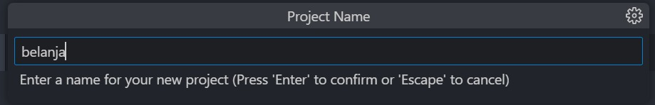

# Praktikum 5: Membangun Navigasi di Flutter

## Langkah 1: Siapkan project baru
Buatlah sebuah project baru Flutter dengan nama belanja dan susunan folder seperti pada gambar berikut. Penyusunan ini dimaksudkan untuk mengorganisasi kode dan widget yang lebih mudah.</br>


</br>

# Langkah 2: Langkah 2: Mendefinisikan Route
Buatlah dua buah file dart dengan nama `home_page.dart` dan `item_page.dart` pada folder <b>pages</b>. Untuk masing-masing file, deklarasikan class `HomePage` pada file `home_page.dart` dan ItemPage pada `item_page.dart`. Turunkan class dari `StatelessWidget`. Gambaran potongan kode dapat anda lihat sebagai berikut.

```dart
import 'package:flutter/material.dart';

class HomePage extends StatelessWidget {
    @override
    Widget build(BuildContext context) {
        throw UnimplementedError();
    }
}
```

```dart
import 'package:flutter/material.dart';

class ItemPage extends StatelessWidget {
    @override
    Widget build(BuildContext context) {
        throw UnimplementedError();
    }
}
```

## Langkah 3: Lengkapi Kode di main.dart
Setelah kedua halaman telah dibuat dan didefinisikan, bukalah file `main.dart`. Pada langkah ini anda akan mendefinisikan <b>Route</b> untuk kedua halaman tersebut. Definisi penamaan <b>route</b> harus bersifat <b>unique</b>. Halaman <b>HomePage</b> didefinisikan sebagai /. Dan halaman <b>ItemPage</b> didefinisikan sebagai /<b>item</b>. Untuk mendefinisikan halaman awal, anda dapat menggunakan `named argument initialRoute`. Gambaran tahapan ini, dapat anda lihat pada potongan kode berikut.

```dart
import 'package:belanja/pages/home_page.dart';
import 'package:belanja/pages/item_page.dart';
import 'package:flutter/material.dart';

void main() {
  runApp(
    MaterialApp(
      initialRoute: '/',
      routes: {
        '/': (context) => HomePage(),
        '/item': (context) => ItemPage()
      },
    ),
  );
}
```

## Langkah 4: Membuat data model
Sebelum melakukan perpindahan halaman dari `HomePage` ke `ItemPage`, dibutuhkan proses pemodelan data. Pada desain mockup, dibutuhkan dua informasi yaitu nama dan harga. Untuk menangani hal ini, buatlah sebuah file dengan nama `item.dart` dan letakkan pada folder <b>models</b>. Pada file ini didefinisikan pemodelan data yang dibutuhkan. Ilustrasi kode yang dibutuhkan, dapat anda lihat pada potongan kode berikut.

```dart
class Item {
  String? name;
  int? price;

  Item({this.name, this.price});
}
```

## Langkah 5: Lengkapi kode di class HomePage
Pada halaman `HomePage` terdapat `ListView` widget. Sumber data `ListView` diambil dari model List dari object Item. Gambaran kode yang dibutuhkan untuk melakukan definisi model dapat anda lihat sebagai berikut.

```dart
  final List<Item> items = [
    Item(name: 'Sugar', price: 5000),
    Item(name: 'Salt', price: 2000),
  ];
```

## Langkah 6: Membuat ListView dan itemBuilder
Untuk menampilkan `ListView` pada praktikum ini digunakan `itemBuilder`. Data diambil dari definisi model yang telah dibuat sebelumnya. Untuk menunjukkan batas data satu dan berikutnya digunakan widget `Card`. Kode yang telah umum pada bagian ini tidak ditampilkan. Gambaran kode yang dibutuhkan dapat anda lihat sebagai berikut.

```dart
Container(
      margin: const EdgeInsets.all(8),
      child: ListView.builder(
        itemCount: items.length,
        itemBuilder: (context, index) {
          final item = items[index];
          return Material(
              child: Card(
                child: Container(
                  margin: const EdgeInsets.all(8),
                  child: Row(
                    children: [
                      Expanded(child: Text(item.name.toString())),
                      Expanded(
                        child: Text(
                          item.price.toString(),
                          textAlign: TextAlign.end,
                        ),
                      )
                    ],
                  ),
                ),
          );
        },
      ),
    );
```

## Langkah 7: Menambahkan aksi pada ListView
Item pada ListView saat ini ketika ditekan masih belum memberikan aksi tertentu. Untuk menambahkan aksi pada ListView dapat digunakan widget `InkWell` atau `GestureDetector`. Perbedaan utamanya `InkWell` merupakan material widget yang memberikan efek ketika ditekan. Sedangkan `GestureDetector` bersifat umum dan bisa juga digunakan untuk gesture lain selain sentuhan. Pada praktikum ini akan digunakan widget `InkWell`.

Untuk menambahkan sentuhan, letakkan cursor pada widget pembuka `Card`. Kemudian gunakan shortcut quick fix dari VSCode (<b>Ctrl +</b> . pada Windows atau <b>Cmd +</b> . pada MacOS). Sorot menu <b>wrap with widget...</b> Ubah nilai widget menjadi `InkWell` serta tambahkan named argument `onTap` yang berisi fungsi untuk berpindah ke halaman `ItemPage`. Ilustrasi potongan kode dapat anda lihat pada potongan berikut.
</br>
Kode pada file `home_page.dart`

```dart

import 'package:belanja/models/item.dart';
import 'package:flutter/material.dart';

class HomePage extends StatelessWidget {
  HomePage({super.key});

  final List<Item> items = [
    Item(name: 'Sugar', price: 5000),
    Item(name: 'Salt', price: 2000),
  ];
  final routeName = '/item';

  @override
  Widget build(BuildContext context) {
    return Scaffold(
      appBar: AppBar(
        title: const Text('Shopping List'),
      ),
      body: Container(
        margin: const EdgeInsets.all(15),
        child: ListView.builder(
          itemCount: items.length,
          itemBuilder: (context, index) {
            final item = items[index];
            return Material(
              child: InkWell(
                onTap: () {
                  Navigator.pushNamed(context, routeName, arguments: item);
                },
                child: Card(
                  child: Container(
                    margin: const EdgeInsets.all(8),
                    child: Row(
                      children: [
                        Expanded(child: Text(item.name.toString())),
                        Expanded(
                          child: Text(
                            item.price.toString(),
                            textAlign: TextAlign.end,
                          ),
                        )
                      ],
                    ),
                  ),
                ),
              ),
            );
          },
        ),
      ),
    );
  }
}
```

Kode pada file `item_page.dart`</br>

```dart
import 'package:belanja/models/item.dart';
import 'package:flutter/material.dart';

class ItemPage extends StatelessWidget {
  const ItemPage({super.key});
  @override
  Widget build(BuildContext context) {
    final itemArgs = ModalRoute.of(context)!.settings.arguments as Item;
    return Scaffold(
      appBar: AppBar(
        title: const Text('Shopping List'),
      ),
      body: Container(
        margin: const EdgeInsets.all(15),
          child: Center(
            child: Row(
              mainAxisAlignment: MainAxisAlignment.center,
              children: [
                Text(
                  itemArgs.name.toString(),
                  style: const TextStyle(fontSize: 24),
                ),
                const SizedBox(width: 6),
                const Text(
                  'with',
                  style: TextStyle(fontSize: 18),
                ),
                const SizedBox(width: 6),
                Text(
                  itemArgs.price.toString(),
                  style: const TextStyle(fontSize: 18),
                ),
              ],
            ),
          ),
      ),
    );
  }
}
```

Output:</br>
