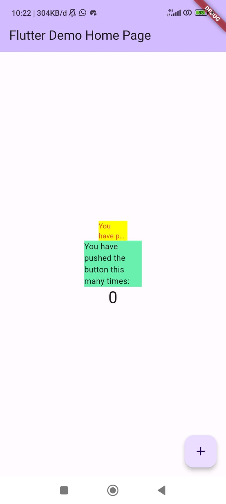

# Praktikum Menerapkan Plugin di Project Flutter

## Langkah 1: Buat Project Baru
Buatlah sebuah project flutter baru dengan nama <b>flutter_plugin_pubdev</b>. Lalu jadikan repository di GitHub Anda dengan nama <b>flutter_plugin_pubdev</b>.

## Langkah 2: Menambahkan Plugin
Tambahkan plugin `auto_size_text` menggunakan perintah berikut di terminal

```
flutter pub add auto_size_text
```

Jika berhasil, maka akan tampil nama plugin beserta versinya di file `pubspec.yaml` pada bagian dependencies.

## Langkah 3: Buat file red_text_widget.dart
Buat file baru bernama `red_text_widget.dart` di dalam folder lib lalu isi kode seperti berikut.

```dart
import 'package:flutter/material.dart';

class RedTextWidget extends StatelessWidget {
  const RedTextWidget({Key? key}) : super(key: key);

  @override
  Widget build(BuildContext context) {
    return Container();
  }
}
```

## Langkah 4: Tambah Widget AutoSizeText
Masih di file `red_text_widget.dart`, untuk menggunakan plugin `auto_size_text`, ubahlah kode `return Container()` menjadi seperti berikut.

```dart
return AutoSizeText(
      text,
      style: const TextStyle(color: Colors.red, fontSize: 14),
      maxLines: 2,
      overflow: TextOverflow.ellipsis,
);
```

Setelah menambahkan kode di atas, akan mendapatkan info error. Karena belum melakukan import plugin `auto_size_text`. Untuk melakukan import tambahkan kode berikut.

```dart
import 'package:auto_size_text/auto_size_text.dart';
```

## Langkah 5: Buat Variabel text dan parameter di constructor
Tambahkan variabel `text` dan parameter di constructor seperti berikut.

```dart
final String text;

const RedTextWidget({Key? key, required this.text}) : super(key: key);
```

## Langkah 6: Tambahkan widget di main.dart
Buka file `main.dart` lalu tambahkan di dalam `children:` pada `class _MyHomePageState`

```dart
Container(
   color: Colors.yellowAccent,
   width: 50,
   child: const RedTextWidget(
             text: 'You have pushed the button this many times:',
          ),
),
Container(
    color: Colors.greenAccent,
    width: 100,
    child: const Text(
           'You have pushed the button this many times:',
          ),
),
```

Output:</br>

</br>
# Tugas Praktikum
1. Jelaskan maksud dari langkah 2 pada praktikum tersebut! </br>
Langkah 2 dilakukan untuk menambahkan plugin auto_size_text ke dalam proyek flutter agar dapat menggunakan fitur-fitur yang disediakan oleh plugin tersebut dalam aplikasi Flutter. Plugin auto_size_text sendiri berguna untuk memungkinkan teks agar secara otomatis menyesuaikan ukurannya sesuai dengan batasan yang ditetapkan (responsive).
   
2. Jelaskan maksud dari langkah 5 pada praktikum tersebut!</br>
Pada langkah 5 menambahkan variabel text dan constructor, variabel text nantinya akan menampung text yang akan ditampilkan dengan widget. Text ini ditangkap menggunakan constructor.
   
3. Pada langkah 6 terdapat dua widget yang ditambahkan, jelaskan fungsi dan perbedaannya!</br>
Pada langkah 6 ditambahkan 2 widget yaitu RedTextWidget dan Text. Fungsi dari 2 widget ini sama yaitu menampilkan teks statis di antarmuka user. Perbedaannya adalah widget Text masih belum ada stylingnya, sedangkan widget RedTextWidget dalam file widgetnya sudah diatur agar warna teksnya menjadi merah dan sudah ditambahkan widget AutoSizeText sehingga ukuran text secara otomatis menyesuaikan ukurannya.

1. Jelaskan maksud dari tiap parameter yang ada di dalam plugin auto_size_text berdasarkan tautan pada dokumentasi ini !</br>
- `key`: Mengontrol bagaimana satu widget menggantikan widget lain dalam pohon.
- `textKey`: Mengatur kunci untuk widget Teks yang dihasilkan.
- `style`: Mengatur gaya yang digunakan untuk teks.
- `minFontSize`:	Mengatur batas ukuran teks minimum yang digunakan saat otomatis menyesuaikan ukuran teks.
- `maxFontSize`:	Mengatur batas ukuran teks maksimum yang digunakan saat otomatis menyesuaikan ukuran teks.
- `stepGranularity`:	Mengatur ukuran langkah di mana ukuran font disesuaikan dengan batasan.
- `presetFontSizes`:	Mendefinisikan semua ukuran font yang mungkin.
- `textAlign`:	Mengatur arah teks secara horizontal.
- `textDirection`*:	Menentukan bagaimana nilai textAlign seperti TextAlign.start dan TextAlign.end diinterpretasikan.
- `locale`:	Digunakan untuk memilih font ketika karakter Unicode yang sama dapat dirender secara berbeda, tergantung pada lokalisasi.
- `softWrap`:	Mengatur apakah teks harus pindah baris.
- `wrapWords`:	Mengatur apakah kata-kata yang tidak muat dalam satu baris harus dibungkus. 
- `overflow`:	Mengatur cara penanganan overflow visual.
- `overflowReplacement`:	Jika teks meluap dan tidak cocok dengan batasannya, widget ini ditampilkan sebagai penggantinya.
- `textScaleFactor`:	Jumlah piksel font untuk setiap piksel logis.
- `maxLines`:	Jumlah maksimum baris opsional untuk teks.
- `semanticsLabel`:	Label semantik alternatif untuk teks.