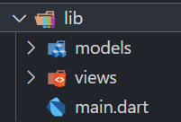
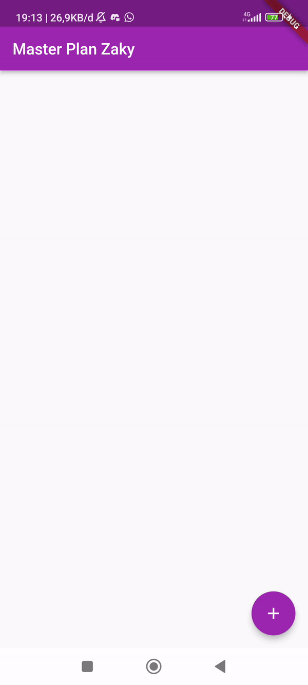
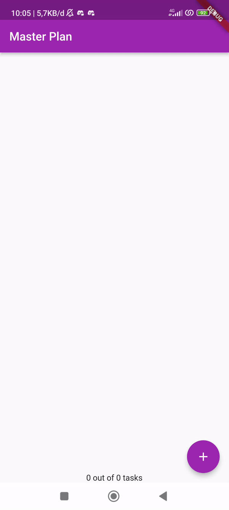

# Praktikum 1: Dasar State dengan Model-View

## Langkah 1: Buat Project Baru


## Langkah 2: Membuat model task.dart

```dart
class Task {
  final String description;
  final bool complete;
  
  const Task({
    this.complete = false,
    this.description = '',
  });
}
```

## Langkah 3: Buat file model plan.dart

```dart
import './task.dart';

class Plan {
  final String name;
  final List<Task> tasks;
  
  const Plan({this.name = '', this.tasks = const []});
}
```

# Langkah 4: Buat file model data_layer.dart

```dart
export 'plan.dart';
export 'task.dart';
```

# Langkah 5: Pindah ke file main.dart

```dart
import 'package:flutter/material.dart';
import './views/plan_screen.dart';

void main() => runApp(MasterPlanApp());

class MasterPlanApp extends StatelessWidget {
  const MasterPlanApp({super.key});

  @override
  Widget build(BuildContext context) {
    return MaterialApp(
     theme: ThemeData(primarySwatch: Colors.purple),
     home: PlanScreen(),
    );
  }
}
```

# Langkah 6 sampai 13 file view plan_screen.dart

```dart
import 'package:flutter/material.dart';

import '../models/data_layer.dart';

class PlanScreen extends StatefulWidget {
  const PlanScreen({super.key});

  @override
  State<PlanScreen> createState() => _PlanScreenState();
}

class _PlanScreenState extends State<PlanScreen> {
  Plan plan = const Plan();
  late ScrollController scrollController;

  @override
  void dispose() {
    scrollController.dispose();
    super.dispose();
  }

  @override
  void initState() {
    super.initState();
    scrollController = ScrollController()
      ..addListener(() {
        FocusScope.of(context).requestFocus(FocusNode());
      });
  }

  @override
  Widget build(BuildContext context) {
    return Scaffold(
      appBar: AppBar(
        title: const Text('Master Plan Zaky'),
      ),
      body: _buildList(),
      floatingActionButton: _buildAddTextButton(),
    );
  }

  Widget _buildTextTile(Task task, int index) {
    return ListTile(
      leading: Checkbox(
          value: task.complete,
          onChanged: (selected) {
            setState(() {
              plan = Plan(
                name: plan.name,
                tasks: List<Task>.from(plan.tasks)
                  ..[index] = Task(
                    description: task.description,
                    complete: selected ?? false,
                  ),
              );
            });
          }),
      title: TextFormField(
        initialValue: task.description,
        onChanged: (text) {
          setState(() {
            plan = Plan(
              name: plan.name,
              tasks: List<Task>.from(plan.tasks)
                ..[index] = Task(
                  complete: task.complete,
                  description: text,
                ),
            );
          });
        },
      ),
    );
  }

  Widget _buildList() {
    return ListView.builder(
      controller: scrollController,
      itemCount: plan.tasks.length,
      itemBuilder: (context, index) => _buildTextTile(plan.tasks[index], index),
      keyboardDismissBehavior: Theme.of(context).platform == TargetPlatform.iOS
          ? ScrollViewKeyboardDismissBehavior.onDrag
          : ScrollViewKeyboardDismissBehavior.manual,
    );
  }

  Widget _buildAddTextButton() {
    return FloatingActionButton(
        child: const Icon(Icons.add),
        onPressed: () {
          setState(() {
            plan = Plan(
              name: plan.name,
              tasks: List<Task>.from(plan.tasks)..add(const Task()),
            );
          });
        });
  }
}
```

# Tugas Praktikum 1: Dasar State dengan Model-View
1. Selesaikan langkah-langkah praktikum tersebut, lalu dokumentasikan berupa GIF hasil akhir praktikum beserta penjelasannya di file README.md! Jika Anda menemukan ada yang error atau tidak berjalan dengan baik, silakan diperbaiki.
   
2. Jelaskan maksud dari langkah 4 pada praktikum tersebut! Mengapa dilakukan demikian?</br>
Jawab: Pada langkah 4 membuat file data_layer.dart yang bertindak sebagai penyedia akses terhadap dua model, yaitu plan.dart dan task.dart, sehingga dapat diimpor ke dalam file atau bagian aplikasi lain yang membutuhkan akses ke data layer ini. Hal ini dilakukan agar struktur kode lebih teratur.

3. Mengapa perlu variabel plan di langkah 6 pada praktikum tersebut? Mengapa dibuat konstanta?</br>
Jawab: Variabel plan diperlukan untuk untuk menyimpan instance dari kelas `Plan`. Dibuat konstanta agar data yang disimpan dalam objek `Plan` dianggap sebagai data tetap atau tidak berubah sepanjang lifecycle widget.

4. Lakukan capture hasil dari Langkah 9 berupa GIF, kemudian jelaskan apa yang telah Anda buat!</br>
Jawab: </br>
</br>

5. Apa kegunaan method pada Langkah 11 dan 13 dalam lifecycle state?</br>
Jawab: Method `initstate()` berguna untuk melakukan inisialisasi awal dan konfigurasi sebelum widget ditampilkan di layar. Method `dispose()` digunakan untuk memastikan bahwa sumber daya yang terkait dengan controller dihapus dan tidak menyebabkan kebocoran memori.

6. Kumpulkan laporan praktikum Anda berupa link commit atau repository GitHub ke spreadsheet yang telah disediakan!


# Praktikum 2: Mengelola Data Layer dengan InheritedWidget dan InheritedNotifier

## Langkah 1: Buat file plan_provider.dart
Buat folder provider di dalam folder lib, dan buat file plan_provider.dart di dalam folder provider.

```dart
import 'package:flutter/material.dart';
import '../models/data_layer.dart';

class PlanProvider extends InheritedNotifier<ValueNotifier<Plan>> {
  const PlanProvider({super.key, required Widget child, required
   ValueNotifier<Plan> notifier})
  : super(child: child, notifier: notifier);

  static ValueNotifier<Plan> of(BuildContext context) {
   return context.
    dependOnInheritedWidgetOfExactType<PlanProvider>()!.notifier!;
  }
}
```

## Langkah 2: Edit main.dart

```dart
return MaterialApp(
  theme: ThemeData(primarySwatch: Colors.purple),
  home: PlanProvider(
    notifier: ValueNotifier<Plan>(const Plan()),
    child: const PlanScreen(),
   ),
);
```

## Langkah 3: Tambah method pada model plan.dart

```dart
int get completedCount => tasks
  .where((task) => task.complete)
  .length;

String get completenessMessage =>
  '$completedCount out of ${tasks.length} tasks';
```

## Langkah 4: Edit PlanScreen agar menggunakan data dari PlanProvider
Hapus deklarasi variabel `plan`

## Langkah 5: Edit method _buildAddTaskButton

```dart
Widget _buildAddTaskButton(BuildContext context) {
  ValueNotifier<Plan> planNotifier = PlanProvider.of(context);
  return FloatingActionButton(
    child: const Icon(Icons.add),
    onPressed: () {
      Plan currentPlan = planNotifier.value;
      planNotifier.value = Plan(
        name: currentPlan.name,
        tasks: List<Task>.from(currentPlan.tasks)..add(const Task()),
      );
    },
  );
}
```

## Langkah 6: Edit method _buildTaskTile
```dart
Widget _buildTaskTile(Task task, int index, BuildContext context) {
  ValueNotifier<Plan> planNotifier = PlanProvider.of(context);
  return ListTile(
    leading: Checkbox(
       value: task.complete,
       onChanged: (selected) {
         Plan currentPlan = planNotifier.value;
         planNotifier.value = Plan(
           name: currentPlan.name,
           tasks: List<Task>.from(currentPlan.tasks)
             ..[index] = Task(
               description: task.description,
               complete: selected ?? false,
             ),
         );
       }),
    title: TextFormField(
      initialValue: task.description,
      onChanged: (text) {
        Plan currentPlan = planNotifier.value;
        planNotifier.value = Plan(
          name: currentPlan.name,
          tasks: List<Task>.from(currentPlan.tasks)
            ..[index] = Task(
              description: text,
              complete: task.complete,
            ),
        );
      },
    ),
  );
}
```

## Langkah 7: Edit _buildList

```dart
Widget _buildList(Plan plan) {
   return ListView.builder(
     controller: scrollController,
     itemCount: plan.tasks.length,
     itemBuilder: (context, index) =>
        _buildTaskTile(plan.tasks[index], index, context),
   );
}
``` 

## Langkah 8: Tambah widget SafeArea

```dart
@override
Widget build(BuildContext context) {
   return Scaffold(
     appBar: AppBar(title: const Text('Master Plan')),
     body: ValueListenableBuilder<Plan>(
       valueListenable: PlanProvider.of(context),
       builder: (context, plan, child) {
         return Column(
           children: [
             Expanded(child: _buildList(plan)),
             SafeArea(child: Text(plan.completenessMessage))
           ],
         );
       },
     ),
     floatingActionButton: _buildAddTaskButton(context),
   );
}
```

# Tugas Praktikum 2: InheritedWidget
1. Selesaikan langkah-langkah praktikum tersebut, lalu dokumentasikan berupa GIF hasil akhir praktikum beserta penjelasannya di file README.md! Jika Anda menemukan ada yang error atau tidak berjalan dengan baik, silakan diperbaiki sesuai dengan tujuan aplikasi tersebut dibuat.
   
2. Jelaskan mana yang dimaksud InheritedWidget pada langkah 1 tersebut! Mengapa yang digunakan InheritedNotifier?</br>
Jawab: `PlanProvider` dalam langkah 1 adalah turunan dari `InheritedNotifier<ValueNotifier<Plan>>`. `InheritedNotifier` adalah implementasi spesifik dari `InheritedWidget` yang menggunakan V`alueNotifier` sebagai notifikasi perubahan. Menggunakan `InheritedNotifier` agar bisa membuat sistem di mana widget di bawahnya dalam hirarki widget dapat melihat dan menanggapi perubahan pada data Plan tanpa harus menyampaikan data itu secara langsung melalui properti.

3. Jelaskan maksud dari method di langkah 3 pada praktikum tersebut! Mengapa dilakukan demikian?</br>
Jawab: Method pertama mengembalikan jumlah tasks yang sudah selesai (complete) dalam rencana plan. Method kedua mengembalikan sebuah string yang memberikan pesan mengenai sejauh mana kelengkapan plan. Dilakukan untuk menampilkan pesan pada footer.

4. Lakukan capture hasil dari Langkah 9 berupa GIF, kemudian jelaskan apa yang telah Anda buat!</br>

   
5. Kumpulkan laporan praktikum Anda berupa link commit atau repository GitHub ke spreadsheet yang telah disediakan!