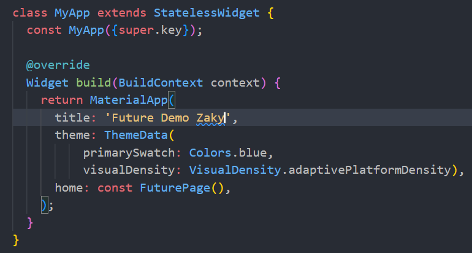

# Praktikum 1: Mengunduh Data dari Web Service (API)

## Soal 1
Tambahkan <b>nama panggilan Anda</b> pada `title app` sebagai identitas hasil pekerjaan Anda. 

## Soal 2
Carilah judul buku favorit Anda di Google Books, lalu ganti ID buku pada variabel path di kode tersebut. Caranya ambil di URL browser Anda seperti gambar berikut ini. 
 
Kemudian cobalah akses di browser URI tersebut dengan lengkap seperti ini. Jika menampilkan data JSON, maka Anda telah berhasil. Lakukan capture milik Anda dan tulis di README pada laporan praktikum. Lalu lakukan commit dengan pesan "<b>W12: Soal 2</b>". 

## Soal 3
<ul><li>Jelaskan maksud kode langkah 5 tersebut terkait `substring` dan `catchError`! 
Fungsi `substring(0, 450)` digunakan untuk mengambil sebagian string dari karakter 0 hingga 449. Ini berarti mengambil 450 karakter pertama dari data tersebut. `catchError` menangkap error yang mungkin terjadi selama proses asynchronous. Saat terjadi error maka kode program pada `catchError` akan dijalankan</li>
<li>Capture hasil praktikum Anda berupa GIF dan lampirkan di README. Lalu lakukan commit dengan pesan "<b>W12: Soal 3</b>". 

</ul>