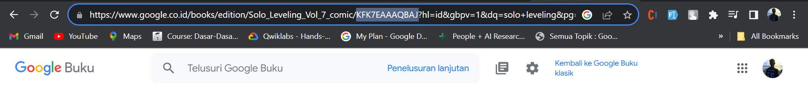
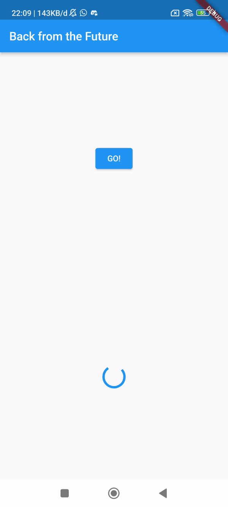

# Praktikum 1: Mengunduh Data dari Web Service (API)

## Soal 1
Tambahkan <b>nama panggilan Anda</b> pada `title app` sebagai identitas hasil pekerjaan Anda. 

## Soal 2
Carilah judul buku favorit Anda di Google Books, lalu ganti ID buku pada variabel path di kode tersebut. Caranya ambil di URL browser Anda seperti gambar berikut ini. 
 
Kemudian cobalah akses di browser URI tersebut dengan lengkap seperti ini. Jika menampilkan data JSON, maka Anda telah berhasil. Lakukan capture milik Anda dan tulis di README pada laporan praktikum. Lalu lakukan commit dengan pesan "<b>W12: Soal 2</b>". 

## Soal 3
<ul><li>

Jelaskan maksud kode langkah 5 tersebut terkait `substring` dan `catchError`!
 

Fungsi `substring(0, 450)` digunakan untuk mengambil sebagian string dari karakter 0 hingga 449. Ini berarti mengambil 450 karakter pertama dari data tersebut. `catchError` menangkap error yang mungkin terjadi selama proses asynchronous. Saat terjadi error maka kode program pada `catchError` akan dijalankan</li>
<li>Capture hasil praktikum Anda berupa GIF dan lampirkan di README. Lalu lakukan commit dengan pesan "<b>W12: Soal 3</b>". 

</ul>

# Praktikum 2: Menggunakan await/async untuk menghindari callbacks

## Soal 4
<ul><li>Jelaskan maksud kode langkah 1 dan 2 tersebut! 

Pada langkah 1, mendefinisikan tiga fungsi asinkron (returnOneAsync, returnTwoAsync, dan returnThreeAsync). Setiap fungsi ini melakukan tunda (delay) selama 3 detik menggunakan Future.delayed dan mengembalikan nilai berturut-turut 1, 2, dan 3 setelah delay selesai. Pada langkah 2 mendefinisikan fungsi asinkron `count()` dengan variabel total. Nilai dari fungsi asinkron yang telah didefinisikan pada langkah 1 diambil secara berurutan menggunakan await. Lalu nilai-nilai tersebut ditambahkan untuk menjadi nilai dari variabel total. Fungsi setState digunakan untuk mengganti nilai variabel result menjadi nilai variabel total.
</li>
<li>Capture hasil praktikum Anda berupa GIF dan lampirkan di README. Lalu lakukan commit dengan pesan "<b>W12: Soal 4</b>". 

</ul>

## Soal 5
<ul><li>
Jelaskan maksud kode langkah 2 tersebut! 

Fungsi `getNumber` membuat objek `Completer`, memicu operasi async dengan memanggil fungsi `calculate`, dan mengembalikan `future` yang akan berisi hasil dari operasi tersebut. Fungsi `calculate` menunggu selama 5 detik, kemudian menyelesaikan objek `Completer` dengan nilai 42, sehingga `future` yang dikembalikan oleh `getNumber` akan berisi nilai tersebut setelah operasi async selesai.
</li>
<li>
Capture hasil praktikum Anda berupa GIF dan lampirkan di README. Lalu lakukan commit dengan pesan "<b>W12: Soal 5</b>". 

</ul>

## Soal 6
<ul><li>
Jelaskan maksud perbedaan kode langkah 2 dengan langkah 5-6 tersebut! 

Perbedaan utama antara langkah 2 dan langkah 5-6 adalah penanganan kesalahan (error handling) yang ditambahkan pada langkah 5-6. Dengan menggunakan blok try-catch dan .catchError, kode dapat menangani situasi di mana terjadi kesalahan selama eksekusi future, dan memberikan respons yang sesuai seperti mengatur nilai result menjadi 'An error occurred'.
</li>
<li>
Capture hasil praktikum Anda berupa GIF dan lampirkan di README. Lalu lakukan commit dengan pesan "<b>W12: Soal 6</b>". 

</ul>
</ul>

## Soal 7
<ul><li>
Capture hasil praktikum Anda berupa GIF dan lampirkan di README. Lalu lakukan commit dengan pesan "<b>W12: Soal 7</b>". 

</ul>

## Soal 8
<ul><li>
Jelaskan maksud perbedaan kode langkah 1 dan 4! 

Perbedaan utama antara langkah 1 dan langkah 4 terletak pada cara pengelolaan future. Pada langkah 1, digunakan `FutureGroup` untuk mengelola sejumlah future secara terpisah sebelum menggabungkannya, sedangkan pada langkah 4, pendekatan lebih sederhana dengan menggunakan `Future.wait` untuk menunggu semua future di dalam list dan mengembalikan future tunggal. Langkah 4 lebih mudah dimengerti daripada langkah 1.
</ul>

## Soal 9
<ul><li>Capture hasil praktikum Anda berupa GIF dan lampirkan di README. Lalu lakukan commit dengan pesan "<b>W12: Soal 9</b>". 

</ul>

## Soal 10
<ul>
<li>

Panggil method `handleError()` tersebut di `ElevatedButton`, lalu run. Apa hasilnya? Jelaskan perbedaan kode langkah 1 dan 4!

Perbedaan antara langkah 1 dan langkah 4 terletak pada cara penanganan exception. Pada langkah 1, exception dilempar secara langsung dari fungsi `returnError`, sementara pada langkah 4, exception tersebut diambil dan diatasi di dalam blok `try-catch` di dalam fungsi `handleError`. Dengan menggunakan struktur `try-catch`, kita memiliki kemampuan untuk memberikan respons khusus terhadap exception yang muncul, seperti mengonfigurasi nilai variabel `result` atau melibatkan tindakan khusus lainnya. Selain itu, pada langkah 4, terdapat blok `finally` yang akan selalu dijalankan, tanpa terpengaruh oleh apakah exception terjadi atau tidak.
</ul>

## Soal 11

<ul>
<li>

Tambahkan nama panggilan Anda pada tiap properti `title` sebagai identitas pekerjaan Anda.  

<ul>

