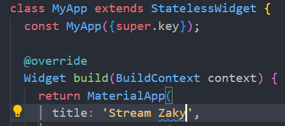
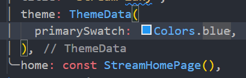
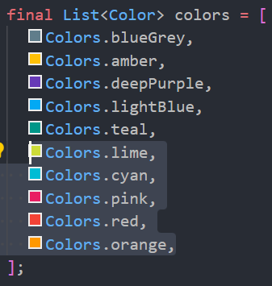
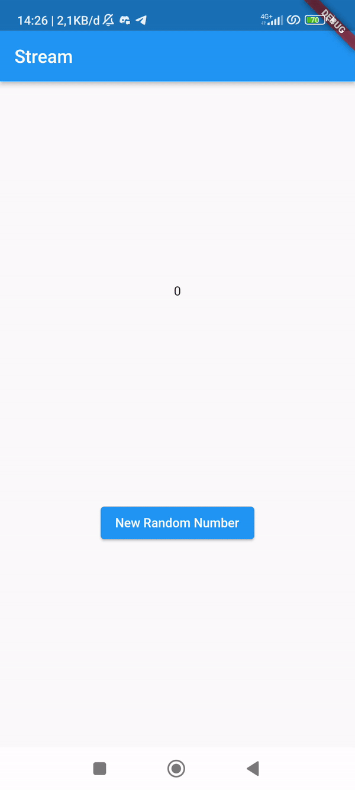

# Praktikum 1: Dart Streams

## Soal 1
<ul>
<li>Tambahkan nama panggilan Anda pada title app sebagai identitas hasil pekerjaan Anda.

</li>
<li>Gantilah warna tema aplikasi sesuai kesukaan Anda.

</li>
<li>Lakukan commit hasil jawaban Soal 1 dengan pesan "<b>W13: Jawaban Soal 1</b>"</li>
</ul>

## Soal 2
<ul>
<li>

Tambahkan 5 warna lainnya sesuai keinginan Anda pada variabel `colors` tersebut.

</li>
<li>
Lakukan commit hasil jawaban Soal 2 dengan pesan "<b>W13: Jawaban Soal 2</b>"
</li>
</ul>

## Soal 3
<ul>
<li>
Jelaskan fungsi keyword yield* pada kode tersebut! 

`yield*` digunakan untuk menyisipkan warna-warna ke dalam stream yang dihasilkan oleh `Stream.periodic.`
</li>
<li>Apa maksud isi perintah kode tersebut? 

Membuat Stream yang mengeluarkan nilai pada interval waktu 1 detik. Menggunakan modulus untuk menghitung indeks warna berdasarkan waktu atau iterasi. Memastikan bahwa indeks tetap dalam rentang panjang daftar warna (colors). Mengembalikan warna dari daftar colors berdasarkan indeks yang dihitung sebelumnya. Lalu menyisipkan nilai-nilai yang dihasilkan oleh Stream.periodic ke dalam stream yang sedang di-generate menggunakan `yield*`
</li>
<li>Lakukan commit hasil jawaban Soal 3 dengan pesan "<b>W13: Jawaban Soal 3</b>"</li>

</ul>

## Soal 4
<ul>
<li>Capture hasil praktikum Anda berupa GIF dan lampirkan di README. 

</li>
<li>Lakukan commit hasil jawaban Soal 4 dengan pesan "W13: Jawaban Soal 4"</li>
</ul>

## Soal 5
<ul>
<li>Jelaskan perbedaan menggunakan listen dan await for (langkah 9)! 
Perbedaannya adalah ketika menggunakan await for, fungsi yang mengandungnya akan menunggu setiap nilai dari stream sebelum melanjutkan eksekusi ke nilai berikutnya. Sedangkan ketike menggunakan listen eksekusi fungsi yang diberikan tidak menunggu setiap nilai di stream, sehingga tidak menghentikan eksekusi program.
</li>
<li>Lakukan commit hasil jawaban Soal 5 dengan pesan "<b>W13: Jawaban Soal 5</b>"</li>
</ul>

# Praktikum 2: Stream controllers dan sinks

## Soal 6
<ul>
<li>Jelaskan maksud kode langkah 8 dan 10 tersebut! 

Pada langkah 8, membuat dan mengelola objek NumberStream yang berfungsi untuk menangani data numerik melalui aliran (stream). Lalu, menggunakan metode listen pada aliran tersebut untuk secara otomatis memperbarui nilai lastNumber setiap kali ada perubahan dalam aliran data numerik. Pada langkah 10, fungsi `addRandomNumber` menghasilkan angka acak (0-9) dan menyuntikkannya ke dalam sink objek `NumberStream`. Ini memicu pengiriman angka kepada semua pendengar yang telah didaftarkan pada stream, termasuk fungsi pada langkah 8 yang memperbarui nilai `lastNumber` saat ada perubahan pada stream.
</li>
<li>
Capture hasil praktikum Anda berupa GIF dan lampirkan di README. 

</li>
<li>Lalu lakukan commit dengan pesan "<b>W13: Jawaban Soal 6</b>".
</ul>